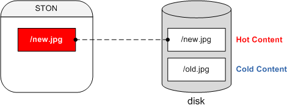
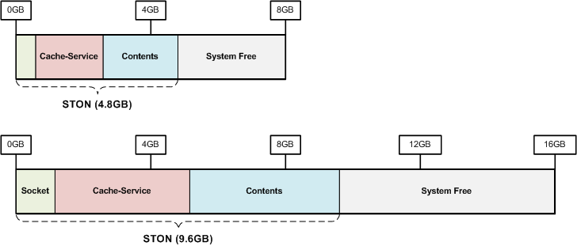
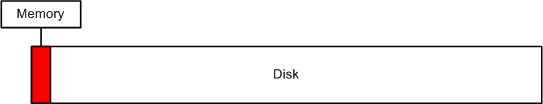
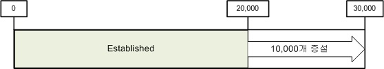
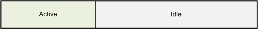
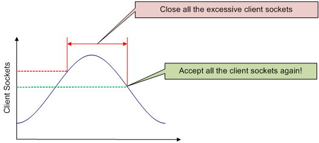
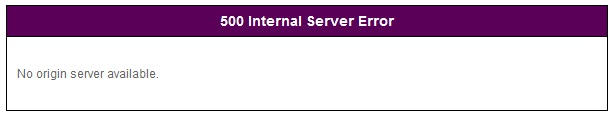

.. _adv_topics:

第20章 最適化とその他のもの
****************************

この章では最適化とその他の雑多が深みのあるトピックについて扱う。 最適化は高性能（High Performance）のための方法でありこれは私たちが追求する最大の価値だ。 エンタープライズ環境での高性能は与えられたハードウェアリソースを最大限に活用することを意味します。

.. note::

   - `[Q&A] STON Edge Serverのメモリモードは、いつ使いますか？ <https://www.youtube.com/watch?v=CzslzYopGlg&list=PLqvIfHb2IlKfRKtHg7vEZtrP7web63sW8&index=6>`_

その中でメモリはすべての設計とポリシーを決定する最も重要な資源です。 特にインデックス（要求されたURLを迅速に見つけること）には必ず理解する必要があります。インデックス速度がサービスの品質に直決するためです。 これから説明するすべての内容は次の表「物理メモリサイズに応じ設定」と関連があります。

============= ============== =============== ============= ========
Physical RAM  System Free    Contents        Caching Count Sockets
============= ============== =============== ============= ========
1GB           409.60MB       188.37MB        219,469       5,000
2GB           819.20MB       446.74MB        520,494       10,000
4GB           1.60GB         963.49MB        1,122,544     20,000
8GB           3.20GB         2.05GB          2,440,422     20,000
16GB          6.40GB         4.45GB          5,303,733     20,000
32GB          12.80GB        9.25GB          11,030,356    20,000
64GB          25.60GB        18.85GB         22,483,603    20,000
128GB         51.20GB        38.05GB         45,390,095    20,000
============= ============== =============== ============= ========

.. toctree::
   :maxdepth: 2

.. _adv_topics_memory_only:

Memory-Onlyモード
====================================

Memory-Onlyモードはディスクなしでコンテンツをメモリのみ積載する方式です。 
:ref:`env-cache-storage` をしない場合自動的にMemory-Onlyモードで動作します。 ::
    
    # server.xml - <Server><Cache>

    <Storage />

このモードでは :ref:`caching-policy-ttl` が短いかコンテンツのサイズが小さい場合に便利です。

- HLSライブ配信
- 価格/在庫
- チケット照会
- リアルタイム順位
- 検索
- API

反対にコンテンツのサイズがGB単位で大きいか :ref:`caching-policy-ttl` が長いサービスでは不適合です。

.. note::

   v2.5.0からサポートされて動的に変更が不可能です。 設定の変更後は必ずサービスを再起動する必要があります。

.. _adv_topics_indexing:

インデックス
====================================

インデックスモードを説明する前にHotコンテンツとColdコンテンツの概念を理解します。

オリジンサーバーからキャッシュしたコンテンツはローカルディスクに保存されます。 そのコンテンツがアクセスされるたびに毎回ディスクから読み取る送信する当然の性能が低下します。 したがって頻繁にアクセスされるコンテンツをメモリにロードしておけば高性能を得ることができます。 このようにメモリにロードされたコンテンツをHotディスクのみあるコンテンツをColdと呼ぶ。

インデックスはHotとColdコンテンツを見つける方法を意味しこれは性能と直結されます。 デフォルトはメモリのインデックスです。 ::

   # server.xml - <Server><Cache>

   <Indexing>Memory</Indexing>

メモリインデックスではColdが存在しません。 すべてのファイルに関する情報はメモリにロードされるためメモリで見つけることができない場合はオリジンサーバーから新規にダウンロードします。 検索時間が非常に短いためその分高性能と迅速なサービス品質を得ることができます。 しかしメモリ容量の制限によりキャッシュ数に限界があります。 その限界は先進表Caching Countを参照します。

ディスクインデックスはHotにない場合はオリジンサーバーに行く前にColdからコンテンツを探す。 ::

   # server.xml - <Server><Cache>

   <Indexing>Disk</Indexing>

この方式はメモリの制限を受けないためCaching Countに制限がない。 Hotコンテンツの場合迅速な品質を保証しますがColdの場合はディスクを使用するため比較的遅い。 簡単に整理するとHotはメモリ速度Coldはディスク速度に収束します。

ディスクインデックスを使用する場合はSSDを使用することを強く推奨します。 インデックスはSTONがインストールされてディスクでのみ実行されます。 STONは一般的にOSと同じディスクにインストールされるのでOSディスクのみSSDに使用しても高性能を期待することができます。

.. note::

   SSDの寿命はアクセス頻度よりWriteされる量によって決定されます。 IntelやSamsungなど供給するSSDの場合最小600TBのWrite寿命を保証します。 これは単に計算してみると一日に20GBずつWriteする場合10年ほどの寿命を予測することができます。 STONからのWriteの99％はLogだ。 このような観点からLogをSSDではなく別のディスク（SASやSATAなど）に記録するようにすれば耐久性を確保することができます。

.. warning::

   インデックスは動的に変更することができないだけでなく変更しても安定性が保証されない。 したがってモードを変更した後 :ref:`getting-started-reset` を行わなければ安全にサービスすることができます。

.. _adv_topics_mem:

メモリ構造
====================================

キャッシュサーバと汎用のWebサーバーの動作は同様の一つの目的は非常に異なっている。 STONの構造と動作を詳細に理解するとより最適化されたサービスが可能です。 最適化の目的は以下の通りです。

**高スループット** パフォーマンスの低下なしに数万のセッションを同時に処理することができます。

**クイック反応** クライアントに遅れのないサービスを提供します。

**オリジンサーバーの負荷を削減** オリジンサーバーの負荷はややもすると全体の障害につながる。

次の図はSTONを8GBと16GBのメモリ装置で駆動させた時のメモリ構成です。

メモリはSTONが使用するメモリと使用していないメモリ（Free）に分ける。 STONが使用するメモリはファイルソケットのようなサービスの規模に依存する資源の数と関連があります。

.. note::

   システム負荷の根本はディスクI / Oのためです。 サービス管理者は "どのように多くContentsをCachingするとディスクI / Oのを減らすことができるか。" を考慮する必要があります。

.. _adv_topics_mem_control:

メモリコントロール
====================================

`メモリ構造`_ は駆動されたとき物理メモリサイズに基づいて計算されます。 ::

   # server.xml - <Server><Cache>

   <SystemMemoryRatio>100</SystemMemoryRatio>

-  ``<SystemMemoryRatio> (デフォルト: 100)`` 物理メモリを基準として使用メモリの割合を設定します。

たとえば8GB機器で ``<SystemMemoryRatio>`` を50に設定すると物理メモリが4GBであるかのように動作します。 これはメモリを占有する他のプロセスのように駆動されるときに有用に使用することができます。

サービスの種類に応じてメモリにロードされるデータの割合を調整すると効果的です。 ::

   # server.xml - <Server><Cache>

   <ContentMemoryRatio>50</ContentMemoryRatio>

-  ``<ContentMemoryRatio> (デフォルト: 50)`` STONが使用するメモリの合計のうちサービスデータメモリロードの割合を設定します。

例えばゲームのポータルのようなファイルの数は少ないがコンテンツのサイズが大きい場合にはこの数値を大きくするとファイルI / Oが減少されます。 反対に非常に小さなファイルが多い場合は減らす設定が役に立つことができます。

.. _adv_topics_sys_free_mem:

システムFreeメモリ
====================================

OS（Operating System）が遅い場合どのようなプログラムも性能が低下します。 STONはOSのために一部のメモリを予備としてのこします。OSのパフォーマンスを最大化するためにありこれをシステムFreeメモリといいます。

.. note::

   Freeメモリに対して客観的な説明を提示したいが残念ながら見つからなかった。 グーグリングを通じて最も多く `引用された文 <http://www.sysxperts.com/home/announce/vmdirtyratioandvmdirtybackgroundratio>`_ を提示します。

============== ===============
Physical RAM   System Free
============== ===============
1GB	           409.6MB
2GB	           819.2MB
4GB            1.6GB
8GB	           3.2GB
16GB	         6.4GB
32GB	         12.8GB
64GB	         25.6GB
128GB	         51.2GB
============== ===============

サービスに詳しいユーザーは状況に合わせてFreeメモリの割合を調節することができます。 Freeメモリが減らしたらより多くのContentsをメモリにロードすることができます。 ::

   # server.xml - <Server><Cache>

   <SystemFreeMemoryRatio>40</SystemFreeMemoryRatio>

-  ``<SystemFreeMemoryRatio> (デフォルト: 40、 最大: 40)`` 物理メモリに基づいて設定された割合だけをFreeメモリに残っている。

Cachingサービスメモリ
====================================

クライアントに配信するコンテンツをCachingするメモリになります。 一度ディスクからメモリにロードされたコンテンツはメモリが不足しないかぎり続けてメモリに常駐します。問題はメモリ不足は頻繁に発生するという点です。

上の図のように送信するコンテンツはディスクいっぱいなのに物理メモリにロードすることができる容量は非常に限られている。 32GBの物理メモリを搭載しても4K動画やMMOゲームクライアントのサイズを考慮するとあまりゆったり方ではない。 いくら効率的にメモリを管理しても物理的なディスクI / O速度に制限されます。

最も効果的な方法はContentsメモリ空間を最大限に確保してディスクI / Oの減らすことになります。 以下は物理メモリの基準でSTONがデフォルト的に設定する最大Contentsメモリサイズです。

=============== ================= ====================
Physical RAM    Contents          Caching Count
=============== ================= ====================
1GB             188.37MB          219,469
2GB             446.74MB          520,494
4GB             963.49MB          1,122,544
8GB             2.05GB            2,440,422
16GB            4.45GB            5,303,733
32GB            9.25GB            11,030,356
64GB            18.85GB           22,483,603
128GB           38.05GB           45,390,095
=============== ================= ====================

Socketメモリ
====================================

ソケットもメモリを消費します。 4GB以上の機器でSTONは2万個のソケットを基に生成します。 ソケット1個= 10KB、1万ソケットは97.6MBのメモリを使用するので約195MBのメモリがデフォルト的にソケットに割り当てられる。

=============== ================= ======================
Physical RAM    Socket Count      Socket Memory
=============== ================= ======================
1GB             5千               50MB
2GB             1万               97.6MB
4GB 以上         2万               195MB
=============== ================= ======================

次の図のようにソケットをすべて使用すると自動的にソケットが増えます。

上の図のように増設され3万個のソケットを使用する場合は合計240MBのメモリがソケットに割り当てられる。 必要なソケットを必要分だけ使用することは何の問題もないように見える。 しかし使用しないソケットを過度に多く設定することはメモリの無駄だ。 例えば10Gbpsの装置ではユーザーごとに10Mbpsの伝送速度を保証することを前提したとき次の式によって最大同時ユーザーは1,000人です。 ::

   10,000Mbps / 10Mbps = 1,000 Sessions

この場合STONが最初に生成する2万のうち19,000個に相当する約148MBは無駄になります。この148MBをContentsに投資する場合の効率をより高めることができます。 最小ソケット数を設定するとメモリをより効率的に使用することができます。

**最小ソケット数** 最初に割り当てられているソケットの数です。

**増設ソケット数**。 ソケットがすべて使用中（Established）のときに設定した数だけソケットを増設します。

もう一つの重要な変数はクライアントKeep-Alive時間設定になります。 (:ref:`handling_http_requests_session_man` を参照)

接続されたすべてのソケットがデータ転送中ではない。 IE、Chromeのようなブラウザは次に発生するHTTPトランスポートのためにソケットをサーバーに接続しておいた状態を維持します。 実際にショッピングモールの場合は接続されているセッションの中でidleセッションの割合は少なくは50％から多くは80％にのぼる。

.. figure:: img/perf_keepalive2.png
   :align: center

Keep-Alive時間を長く与えるほどソケットの再利用は良くなりますが、維持されるIdleソケットの数が増加するのでメモリを無駄使いが悪化します。サービスに合わせたクライアントKeep-Alive時間を設定することが重要です。

.. _adv_topics_tso:

TCP Segmentation Offload
====================================

.. important::

   10G NICを使用する場合はTSO（TCP Segmentation Offload）のOFF設定がお勧めです。

TCPは送信時のパケットを分割（Segmentation）がこの作業をCPUではなくNICが実行するように設定することがTSOです。 （デフォルトはONです。）しかし10G NICサービス環境では我々はそれに関連する多くの障害を経験した。

-  TCPパケットlossとdelay
-  TCP disconnect
-  Load Averageの異常増加

結論としてTSOはすべての期待ほど高い性能を出せないものと推定されます。 （NICのみ1Gに変えてもこのような問題は発生しませんでした。）結論としてTSOをOFFに設定することによりサービスは正常化された。 これによるCPU使用率は心配するレベルではなくサービスの規模と比例する正直な指標を示してくれる。

TSOの設定は次のように設定/確認することができます。 （Kの大文字/小文字に注意する必要があります。） ::

   # ethtool -K ethX tso off        // TSO OFF 設定
   # ethtool -k ethX                // 設定閲覧
   ...
   tcp segmentation offload: on
   ...

.. Tip::

   詳細については以下のリンクを参照します。

   -  `http://sandilands.info/sgordon/segmentation-offloading-with-wireshark-and-ethtool <http://sandilands.info/sgordon/segmentation-offloading-with-wireshark-and-ethtool>`_
   -  `http://www.linuxfoundation.org/collaborate/workgroups/networking/tso <http://www.linuxfoundation.org/collaborate/workgroups/networking/tso>`_
   -  `http://www.packetinside.com/2013/02/mtu-1500.html <http://www.packetinside.com/2013/02/mtu-1500.html>`_

クライアントアクセス制限
====================================

無制限にクライアント要求を許可するとシステムに過度な負荷が発生します。システムの過負荷は障害になります。適切な数値でクライアントの要求を拒否してシステムを保護します。 ::

   # server.xml - <Server><Cache>

   <MaxSockets Reopen="75">80000</MaxSockets>

-  ``<MaxSockets> (デフォルト: 80000, 最大: 100000)`` の接続を許可するクライアントの最大ソケット数。 この数値を超えると新規クライアント接続をすぐに閉める。
   ``<MaxSockets>`` の ``Reopen (デフォルト: 75%)`` の割合だけソケット数が減少すると再び接続を可能にします。

（デフォルト設定で）完全なクライアントソケットの数が8だけ超える新規クライアント接続は直ちに終了されます。全クライアントソケットの数が6万（8万75％）になると再びアクセスを可能にします。

例えば3万個のクライアントセッションを処理するときにオリジンサーバーがすべての制限に達するとこの数値を3〜4万程度に設定するのが良い。 これにより得られる効果は以下の通りです。

-  特特別Network構成（eg L4セッション制御など）が必要ない。
-  不要な（元の負荷で処理することができない）クライアントの要求を防止します。
-  サービスの信頼性を高める。 サービスBurst以降の再起動など点検作業が必要ない。

HTTPクライアントセッション数
====================================

HTTPクライアントの接続を処理するための初期/増設セッション数を設定します。 ::

    # server.xml - <Server><Cache>

    <HttpClientSession>
       <Init>20000</Init>
       <TopUp>6000</TopUp>
    </HttpClientSession>

-  ``<Init>`` STON起動時にあらかじめ作成しておくソケット数

-  ``<TopUp>`` 生成しておいたソケットの数を超えたときに追加で作成することがソケット数

別に設定していない場合は物理メモリのサイズに応じて自動的に設定されます。

=============== =========================
物理メモリ	    <Init>、 <TopUp>
=============== =========================
1GB             5000、1000 
2GB             10000、2000
4GB             20000、4000
8GB 以上        20000、6000 
=============== =========================
限定的な環境で少ない数のソケットだけでサービスが可能な場合ソケットの数を減らすメモリを節約することができます。

.. _adv_topics_req_hit_ratio:

Request hit ratio
====================================

まずクライアントのHTTP要求がどのように処理されるかを理解します。 キャッシュ処理の結果はSquidと同じようにTCP_*と命名され各表現ごとにキャッシュサーバが処理した方式を意味します。

-  ``TCP_HIT`` 要求されたリソース（無期限）がキャッシュされてすぐに応答します。
-  ``TCP_IMS_HIT`` IMS（If-Modified-Since）ヘッダと要求されたリソースが有効期間ないでキャッシュされて304 NOT MODIFIEDに応答します。 TTLExtensionBy4xx、TTLExtensionBy5xx設定に該当する場合にもこれに該当します。
-  ``TCP_REFRESH_HIT`` 要求されたリソースが期限切れになってオリジンサーバーの確認（オリジン変更なし、304 NOT MODIFIED）後に応答します。 リソースの有効期限延長。
-  ``TCP_REF_FAIL_HIT`` TCP_REFRESH_HIT過程の中オリジンサーバーで確認が失敗（接続の失敗伝送遅延）した場合有効期限が切れたコンテンツで応答します。
-  ``TCP_NEGATIVE_HIT`` 要求されたリソースが異常状態（オリジンサーバー接続/送信の失敗4xx応答、5xx応答）にキャッシュされてその状態を応答します。
-  ``TCP_REDIRECT_HIT`` サービス許可/拒否/ Redirect条件によってRedirectを応答します。
-  ``TCP_MISS`` 要求されたリソースがキャッシュされていない（=最初の要求）。 オリジンサーバーから取得したコンテンツで応答します。
-  ``TCP_REF_MISS`` 要求されたリソースが期限切れになってオリジンサーバーの確認（オリジンサーバーの変更、200 OK）した後の応答します。 新しいリソースがキャッシュされます。
-  ``TCP_CLIENT_REFRESH_MISS`` 要求をオリジンサーバーにバイパス。
-  ``TCP_ERROR`` 要求されたリソースがキャッシュされていない（=最初の要求）。 オリジンサーバー障害（接続の失敗伝送遅延原稿排除）によりリソースをキャッシュできない。 クライアントに500 Internal Errorで応答します。
-  ``TCP_DENIED`` 要求は拒否されました。

以上を総合してRequest hit ratioの計算式は次の通りです。 ::

   TCP_HIT + TCP_IMS_HIT + TCP_REFRESH_HIT + TCP_REF_FAIL_HIT + TCP_NEGATIVE_HIT + TCP_REDIRECT_HIT
   ------------------------------------------------------------------------------------------------
                                            SUM(TCP_*)

Byte hit ratio
====================================

クライアントに送信したトラフィック（Client Outbound）比オリジンサーバーから送信されたトラフィック（Origin Inbound）の割合を示す。 オリジンサーバーのトラフィックがクライアントのトラフィックよりも高い場合負のが出てくることができます。 ::

   Client Outbound - Origin Inbound
   --------------------------------
           Client Outbound

オリジンサーバーの障害状況ポリシー
====================================

ユーザーがいつでもオリジンサーバーをチェックできるようにすることがSTONの目標だ。 オリジンサーバーの障害が検出されるとサーバーは自動的に排除されてリカバリモードに転換されます。 障害サーバーが再起動されても通常のサービスの状態を確認しなければなら再度投入します。

もしすべてのオリジンサーバーの障害を検出した場合現在のキャッシュされたコンテンツへのサービスを行う。 TTLが期限切れコンテンツはオリジンサーバーが復旧するまで自動的に延長されます。 さらにPurgeされたコンテンツの場合でもオリジンサーバーからキャッシュすることができない場合は復旧させサービスに問題がないように動作します。 最大限クライアントに障害状況を公開してはいけないという方針です。 完全障害状況で新規コンテンツ要求が入ってくると次のようなエラーページと理由が指定されます。

   まあまあの程とこのような画面は表示する嫌いだ。

時間単位の表現と範囲
====================================

基準時間が "超" の項目について文字列として時間表現が可能です。 以下はサポートされる時間の表現のリストと換算された秒（sec）です。

=========================== =========================
表現	                      換算
=========================== =========================
year(s)                     31536000 秒 (=365 days)
month(s)                    2592000 秒 (=30 days)
week(s)                     604800 秒 (=7 days)
day(s)                      86400 秒 (=24 hours)
hour(s)	                    3600 秒 (=60 mins)
minute(s), min(s)	          60 秒
second(s), sec(s), (省略)	  1 秒
=========================== =========================

次のように組み合わせた時間の表現が可能です。 ::

    1year 3months 2weeks 4days 7hours 10mins 36secs

現在サポート対象は以下の通りです。

- Custom TTLの時間表現
- TTLのRatioを除くすべて
- ClientKeepAliveSec
- ConnectTimeout
- ReceiveTimeout
- BypassConnectTimeout
- BypassReceiveTimeout
- ReuseTimeout
- RecoveryのCycle属性
- Bandwidth Throttling

Emergencyモード
====================================

内部的にすべての仮想ホストがMemoryBlockを共有しながらデータを管理するように設計されている。 新規メモリが必要な場合は参照されない古いMemoryBlockを再利用して新規メモリを確保します。 このプロセスをMemory-Swapと呼ぶ。 このような構造により長期間運用しても安定性を確保することができます。

.. figure:: img/faq_emergency1.png
   :align: center

   コンテンツデータはMemoryBlockに含まれてサービスされます。

上の図の右側の状況のようにすべてのMemoryBlockが使用中で再利用することができるMemoryBlockが存在しない状況が発生することができます。 この時Memory-Swapが不可能になる。 たとえばすべてのクライアントが異なるデータ領域を非常に少しずつダウンロードしたりオリジンサーバーから別のデータを非常に少しずつ送信する状況が同時に発生する場合が最悪です。 このような場合はシステムから新しいメモリを割り当てて使用することも方法です。 しかしこのような状況が続く場合はメモリ使用量が高くなる。 メモリ使用量が過度に高くなる場合はシステムメモリのスワップを発生させたり最悪の場合はOSがSTONを終了させる状況が発生することがあります。

.. note::

   Emergencyモードとメモリ不足の状況が発生した場合一時的に新規MemoryBlockの割り当てを禁止させる状況を意味します。

これは過剰メモリ使用からサービスを守るための方法であり再利用可能なMemoryBlockが十分に確保されると自動的に終了されます。 ::

    # server.xml - <Server><Cache>

    <EmergencyMode>OFF</EmergencyMode>

-  ``<EmergencyMode>``

   - ``OFF (デフォルト)`` を使用しません。

   - ``ON`` を使用します。

EmergencyモードのときSTONは次のように動作します。

- すでにロードされているコンテンツはそのままサービスされます。
- バイパスは通常行われる。
- ロードされていないコンテンツについては503 service temporarily unavailableで応答します。 TCP_ERROR状態が増加します。
- Idleクライアントソケットを素早く整理します。
- 新規コンテンツをキャッシュすることができない。
- TTLが期限切れコンテンツを更新しません。 
- SNMPのcache.vhost.statusとXML / JSON統計のHost.State値が "Emergency" で提供されます。
- InfoログにEmergencyモードに切り替え/オフを次のように記録します。 ::

    2013-08-07 21:10:42 [WARNING] Emergency mode activated. (Memory overused: +100.23MB)
    ...(省略)...
    2013-08-07 21:10:43 [NOTICE] Emergency mode inactivated.

ディスクHot-Swap
====================================

サービスを中断せずディスクを交換します。必ず ``<Disk>`` 設定と同じパラメータにする必要があります。 ::

   http://127.0.0.1:10040/command/unmount?disk=...
   http://127.0.0.1:10040/command/umount?disk=...

排除されたディスクはすぐに使用しないようになり、そのディスクに保存されたすべてのコンテンツは無効化されます。 管理者によって排除されたディスクの状態は "Unmounted" に設定されます。

ディスクをサービスに再投入するには次のように呼び出します。 ::

   http://127.0.0.1:10040/command/mount?disk=...

再投入されたディスクのすべてのコンテンツは無効化されます。

.. _adv_topics_syncstale:

SyncStale
====================================

（インデックス時点とパフォーマンス上の理由で）異常サービス終了時の管理者が :ref:`api-cmd-purge` 、 :ref:`api-cmd-expire` 、 :ref:`api-cmd-hardpurge` したコンテンツがインデックスから失われることがあります。 これを補完するためにAPI呼び出しをログに記録してサービスの再起動時に反映します。 ::

    # server.xml - <Server><Cache>

    <SyncStale>ON</SyncStale>

-  ``<SyncStale>``

   - ``ON  (デフォルト)`` 駆動される同期します。

   - ``OFF`` 無視します。

ログは./stale.logに記録され正常終了または定期的インデックスの時点で初期化されます。
