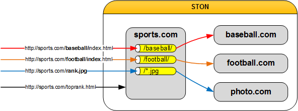
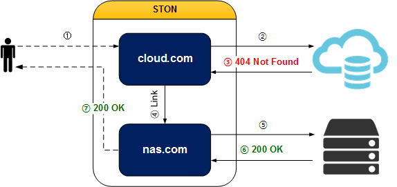
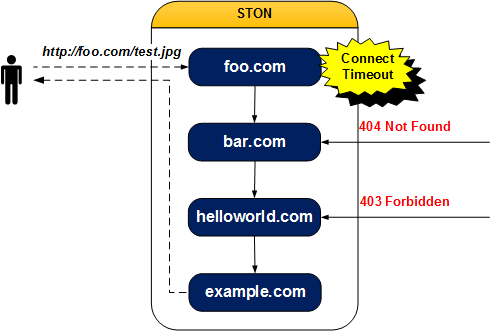

.. _adv-vhost:

第14章 仮想ホストの高度なテクニック
******************

この章では仮想ホストを使用してサービスを柔軟に構成する複数の方法について説明します。

仮想ホストは一般的にオリジンサーバーのDomainまたはIPリストと1：1で構成されます。 しかし状況に応じて代表仮想ホストを複数のサブ仮想ホストに分岐したり反対に独立した複数の仮想ホストを一つのサービスとして提供する場合も発生します。 各機能に応じて :ref:`monitoring_stats_vhost_client` / :ref:`admin-log-access` のポリシーが異なる場合があることに注意する必要があります。

.. toctree::
   :maxdepth: 2

.. _adv-vhost-url-rewrite:

URL前処理
====================================

`正規表現 <http://en.wikipedia.org/wiki/Regular_expression>`_ 使用して要求されたURLを変更します。 URL前処理が設定されている場合はすべてのクライアントの要求（HTTPまたはFile I / O）は必ずURL Rewriterを経る。

.. figure:: img/urlrewrite1.png
   :align: center

   URL Rewriterを経由して仮想ホストにアクセスします。

もしURL RewriterによってアクセスしようとするHostの名前が変更された場合クライアントのHTTP要求のHostヘッダが変更されたとみなされます。 URLの前処理は仮想ホストの設定（vhosts.xml）に設定します。 ほとんどの設定は仮想ホストに依存しますがURL前処理の場合クライアントが要求したHostの名前を変更することができますので仮想ホストと同じレベルに設定します。 ::

   # vhosts.xml

   <Vhosts>
      <Vhost ...> ... </Vhost>
      <Vhost ...> ... </Vhost>
      <URLRewrite ...> ... </URLRewrite>
      <URLRewrite ...> ... </URLRewrite>
   </Vhosts>

マルチに設定することができ順次正規表現に一致有無を比較します。 ::

   # vhosts.xml - <Vhosts>

   <URLRewrite AccessLog="Replace">
       <Pattern>www.exmaple.com/([^/]+)/(.*)</Pattern>
       <Replace>#1.exmaple.com/#2</Replace>
   </URLRewrite>

-  ``<URLRewrite>``

  URL前処理を設定します。
   ``AccessLog (デフォルト: Replace)`` 属性はAccessログに記録されるURLを設定します。
   ``Replace`` の場合変換後のURL（/logo.jpg）を ``Pattern`` の場合変換前のURL（/baseball/logo.jpg）をAccessログに記録します。

   -  ``<Pattern>`` マッチングさせるパターンを設定します。 一つのパターンは（）括弧を使用して表現されます。

   -  ``<Replace>`` 変換形式を設定します。 一致したパターンには＃1＃2のように使用することができます。 ＃0は要求URL全体を意味します。 パターンは最大9個（＃9）まで指定することができます。

スループットは :ref:`monitoring_stats` で提供され :ref:`api-graph-urlrewrite` でも確認することができます。 URL前処理は :ref:`media-trimming` 、 :ref:`media-hls` などの他の機能と組み合わせて表現を簡単にします。 ::

   # vhosts.xml - <Vhosts>

   <URLRewrite>
       <Pattern>example.com/([^/]+)/(.*)</Pattern>
       <Replace>example.com/#1.php?id=#2</Replace>
   </URLRewrite>
   // Pattern : example.com/releasenotes/1.3.4
   // Replace : example.com/releasenotes.php?id=1.3.4

   <URLRewrite>
       <Pattern>example.com/download/(.*)</Pattern>
       <Replace>download.example.com/#1</Replace>
   </URLRewrite>
   // Pattern : example.com/download/1.3.4
   // Replace : download.example.com/1.3.4

   <URLRewrite>
       <Pattern>example.com/img/(.*\.(jpg|png).*)</Pattern>
       <Replace>example.com/#1/STON/composite/watermark1</Replace>
   </URLRewrite>
   // Pattern : example.com/img/image.jpg?date=20140326
   // Replace : example.com/image.jpg?date=20140326/STON/composite/watermark1

   <URLRewrite>
       <Pattern>example.com/preview/(.*)\.(mp3|mp4|m4a)$</Pattern>
       <Replace><![CDATA[example.com/#1.#2?&end=30&boost=10&bandwidth=2000&ratio=100]]></Replace>
   </URLRewrite>
   // Pattern : example.com/preview/audio.m4a
   // Replace : example.com/audio.m4a?end=30&boost=10&bandwidth=2000&ratio=100

   <URLRewrite>
       <Pattern>example.com/(.*)\.mp4\.m3u8$</Pattern>
       <Replace>example.com/#1.mp4/mp4hls/index.m3u8</Replace>
   </URLRewrite>
   // Pattern : example.com/video.mp4.m3u8
   // Replace : example.com/video.mp4/mp4hls/index.m3u8

   <URLRewrite>
       <Pattern>example.com/(.*)_(.*)_(.*)</Pattern>
       <Replace>example.com/#0/#1/#2/#3</Replace>
   </URLRewrite>
   // Pattern : example.com/video.mp4_10_20
   // Replace : example.com/example.com/video.mp4_10_20/video.mp4/10/20

.. note::

   次のように類似したサブドメインがある場合は注意する必要があります。 ::
   
      image.example.com
      myimage.example.com
      
   正規表現では、image.exampe.comにパターンを作成した場合myimage.example.comもパターンと一致するものとみなされる。 これを防止するために、先頭に文字なしを ``^`` で表記ヘジュオヤimage.example.comのみマッチングさせることができる。 ::

      <URLRewrite>
         <Pattern>^image.example.com/img/(.*\.(jpg|png).*)</Pattern>
         <Replace>image.example.com/#1/STON/composite/watermark1</Replace>
      </URLRewrite>

パターンの表現にXMLの5つの特殊文字（ " ＆ ' < > ）が入る場合は<！[CDATA [... ]]>で囲んで正しく設定されている。
:ref:`wm` を使用して設定するとすべてのパターンはCDATAとして処理されます。

.. _adv-vhost-facadevhost:

Facade仮想ホスト
====================================

``<Alias>`` は仮想ホストの別名だけを追加しているので統計とログが分離されない。 仮想ホストは共有がドメインに基づいて :ref:`monitoring_stats_vhost_client` と :ref:`admin-log-access` を分離したい場合Facade仮想ホストを設定します。

.. figure:: img/adv_vhost_facade.png
   :align: center

   facadeは統計とログを収集します。

::

    # vhosts.xml - <Vhosts>

    <Vhost Name="example.com">
       ...
    </Vhost>

    <Vhost Name="another.com" Status="facade:example.com">
       ...
    </Vhost>

``Status`` 属性の値を ``facade:`` + ``仮想ホスト`` に設定します。 例の場合 :ref:`monitoring_stats_vhost_client` と :ref:`admin-log-access` はexample.comではなくクライアントが要求したドメインであるanother.comに収集されます。

.. _adv-vhost-sub-path:

Sub-Path指定
====================================

仮想ホストでパス別に他の仮想ホストが処理するように設定することができます。

   統計/ログは要求を最終処理した各仮想ホストに記録されます。

::

   # vhosts.xml - <Vhosts>

   <Vhost Name="sports.com">
     
       <Path Vhost="baseball.com">/baseball/<Path>
       <Path Vhost="football.com">/football/<Path>
       <Path Vhost="photo.com">/*.jpg<Path>
     
   </Vhost>

   <Vhost Name="baseball.com" />
   <Vhost Name="football.com" />
   <Vhost Name="photo.com" />

-  ```` パスまたはパターンが一致するとその要求を別の仮想ホストに送る。 一致しない場合のみ現在の仮想ホストが処理します。

   - ``Status (デフォルト: Active)`` Inactiveの場合は無視します。

   -  ``<Path>`` クライアントが要求したURIとパスが一致した場合 ``Vhost`` にその要求を送る。 値はパスまたはパターンのみ可能です。 ::

         <Path Vhost="baseball.com">baseball<Path>
         <Path Vhost="photo.com">*.jpg<Path>

      上記のように入力してもそれぞれ/ baseball /と/*.jpgとして認識されます。

たとえばクライアントが次のようにリクエストした場合その要求は仮想ホストのfootball.comが処理します。 ::

   GET /football/rank.html HTTP/1.1
   Host: sports.com

.. _adv-vhost-redirection-trace:

Redirect追跡
====================================

オリジンサーバーでRedirect系（301、302、303、307）で応答する場合Locationヘッダを追跡してコンテンツを要請します。

   .. figure:: img/conf_redirectiontrace.png
      :align: center

      クライアントはRedirectかどうかを知らない。

::

   # server.xml - <Server><VHostDefault><OriginOptions>
   # vhosts.xml - <Vhosts><Vhost><OriginOptions>

   <RedirectionTrace>OFF</RedirectionTrace>

-  ``<RedirectionTrace>``

   - ``OFF (デフォルト)`` 3xx 応答で保存されます。

   - ``ON`` Locationヘッダに記載されアドレスからコンテンツをダウンロードします。 形式に合わない場合Locationヘッダがない場合は動作しません。 無限Redirectされることを防止するため1回だけ追跡します。

.. _adv-vhost-link:

仮想ホストのリンク
====================================

コンテンツが複数のオリジンサーバーに分散している場合は仮想ホストのリンクを利用してコンテンツが統合されているようにサービスが可能です。 特にOn-Premiseからクラウドにストレージへのマイグレーションまたはストレージのコンテンツが分散している環境に有用です。

   cloud.comにないコンテンツはnas.comが処理します。

::

   # vhosts.xml - <Vhosts><Vhost>

   <VhostLink Condition="...">...</VhostLink>

-  ``<VhostLink>`` 要求を委任する仮想ホスト名。 コンテンツのオリジンサーバーの応答が ``Condition`` を満足すれば指定した仮想ホストに要求を委任します。 ただし一つだけ設定することができます。

   - ``Condition`` HTTP応答コード/パターン（1xx、2xx、3xx、4xx、5xx）、fail（オリジンサーバーからキャッシュしていなかった場合）

クライアントの要求が他の仮想ホストに委任されても :ref:`monitoring_stats_vhost_client` と :ref:`admin-log-access` はクライアントがアクセスした仮想ホストに記録されます。

.. note::

   リンク関係にある仮想ホストの設定が異なる場合意図しない動作する場合がありますので注意する必要があります。 仮想ホストのリンクがA（単純キャッシュ） - > B（イメージ圧縮）で結ばれている場合はAで処理されたイメージは圧縮されませんがBで処理されたイメージは圧縮されます。

たとえばnas.comのコンテンツをcloud.comに移転している場合cloud.comにない（= 404 Not Found）コンテンツのみnas.comに要求を送信します。 以下の場合要求はnas.comによって処理されても :ref:`monitoring_stats_vhost_client` と :ref:`admin-log-access` はcloud.comに記録されます。

::

   # vhosts.xml - <Vhosts>

   // cloud.comにない(=404 Not Found) のコンテンツは nas.comで サービスする。
   <Vhost Name="cloud.com">
     <VhostLink Condition="404">nas.com</VhostLink>
   </Vhost>

   <Vhost Name="nas.com">
   </Vhost>

:ref:`admin-log-access` のvhostlinkフィールドを介してクライアントの要求がどの仮想ホストで処理されたことが確認できます。 "-" は要求がリンクされていないことを意味し "nas.com" は要求がリンクされてnas.comで処理されたことを意味します。 ::

    #Fields: date time s-ip cs-method cs-uri-stem ...(中略)... vhostlink
    2016.11.24 16:52:24 220.134.10.5 GET /web/h.gif ...(中略)... -
    2016.11.24 16:52:26 220.134.10.5 GET /favicon.ico ...(中略)... nas.com

リンクが複数回発生した場合 "+" を区切り文字としてリンクされたすべての仮想ホストが表示されます。 この場合最後の仮想ホストが最終リクエストを処理した仮想ホストです。

次のように複数の仮想ホストを別の条件でリンクすることができます。

::

   # vhosts.xml - <Vhosts>

   //  オリジンサーバーが 5 xxに 応答したり キャッシュしてい なかった 場合 （= fail） 要求を bar.comに 委任する 。
   <Vhost Name="foo.com">
     <VhostLink Condition="5xx,fail">bar.com</VhostLink>
   </Vhost>

   // オリジンサーバーが 4 xxに 応答した ときに その 要求を helloworld.comに 委任する 。
   <Vhost Name="bar.com">
     <VhostLink Condition="4xx">helloworld.com</VhostLink>
   </Vhost>

   // オリジンサーバーで 403404または 5 xxに 応答した ときに その 要求を example.comに 委任する 。
   <Vhost Name="helloworld.com">
     <VhostLink Condition="403,404,5xx">example.com</VhostLink>
   </Vhost>

   // これ以上は委任しない 。
   <Vhost Name="example.com">
   </Vhost>

   抑止ながら可能です。

上記の例の場合foo.comの :ref:`admin-log-access` は次のとおりです。 ::

   #Fields: date time s-ip cs-method cs-uri-stem ...(中略)... vhostlink
   2016.11.24 16:52:24 220.134.10.5 GET /test.jpg ...(中略)... bar.com+helloworld.com+example.com

次の場合はリンクはすぐに中断されます。

* ターゲット仮想ホストが存在しない場合（foo.com - >？）
* 自分自身をターゲット仮想ホストに指定した場合（foo.com - > foo.com）
* 再帰リンク（Recursive Link）が発生した場合（foo.com - > bar.com - > foo.com）
