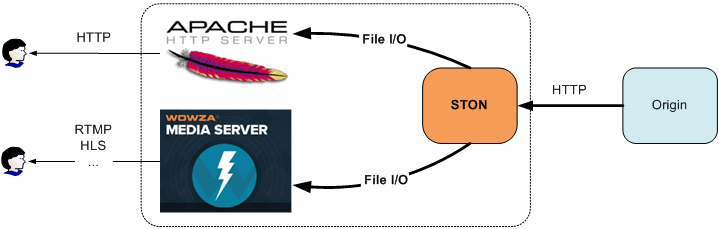
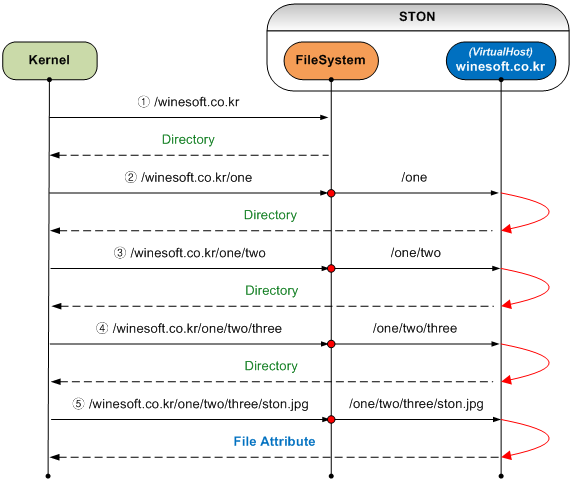
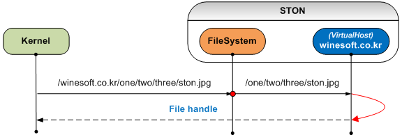
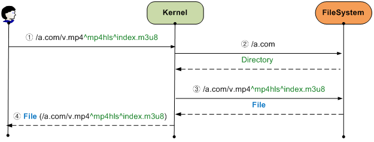

.. _filesystem:

第19章 File System
******************

この章ではSTONをローカルディスクのように使用する方法について説明します。 STONは `FUSE <http://fuse.sourceforge.net/>`_ をベースにLinux VFS（Virtual File System）でMountされる。 Mountされたパスのすべてのファイルは、アクセスされた瞬間Cachingますが、他のプロセスは、この事実を知らない。
**Caching機能が搭載されたReadOnlyディスク** に理解してよい。

.. figure:: img/conf_fs1.png
   :align: center

   `Fuse <http://upload.wikimedia.org/wikipedia/commons/0/08/FUSE_structure.svg>`_ 구조

構造File I / O関数の呼び出しをLinux KernelがSTONに直接伝達する過程でどのような要素（物理ファイルI / OまたはSocket通信など）も介入しません。 このような構造は非常に高い性能を実現します。 STONのメモリCachingを介して物理ディスクのアクセスよりも早い速度を期待することができます。

.. toctree::
   :maxdepth: 2

Mountする
====================================

グローバル設定（server.xml）に設定します。 ::

   # server.xml - <Server><Cache>

   <FileSystem Mount="/cachefs" DotDir="OFF" Separator="^">OFF</FileSystem>

-  ``<FileSystem>``

   -  ``OFF ((デフォルト)`` 何もしません。

   -  ``ON``  STONを ``Mount`` 属性のパスでMountします。

既存のHTTPの構造そのままでCacheモジュールにアクセスする方法（File System）が追加された構造で開発された。 したがって、どちらからのアクセスでもCachingは、最初一度だけ行われ、HTTPまたはFile I / Oにサービスされる。 FileSystemはCacheモジュールにアクセスするもう一つの新しい道になりました。 

.. figure:: img/conf_fs2.png
   :align: center

   HTTPとFile I / OがCacheモジュールを共有します。

ソースサーバーのコンテンツをHTTPだけでなく、File I / Oの両方からアクセスすることができる。 これを活用すれば、ローカルファイルに基づいたソリューションの可用性をさらに高めることができる。

   どのサーバーでもOK

現在STON File Systemがサポートしている関数の一覧は以下の通りです。

========= =============== ===========
FUSE	  C	              LINUX
========= =============== ===========
open	  fopen	          open
release	  fclose	      close
read	  fseek, fread	  seek, read
getattr	  fstat	          stat
unlink	  remove	      unlink
========= =============== ===========

File I / Oは内部的にいくつかの段階を経る。 各ステップの理解が土台にならなければ最高のパフォーマンスを得ることができる。

仮想ホストを探す
====================================

最初のコースは、アクセスしようとする仮想ホストを見つけることです。 HTTPリクエストには、次のようにHostヘッダが指定されて、仮想ホストを簡単に見つけることができる。 ::

    GET /ston.jpg HTTP/1.1
    host: example.com

File Systemは、最初のパスで、この問題を解決します。 例えば、STONが/ cachefsというパスでMountされている場合は、ローカルファイルにアクセスするには、次のパスを使用する必要がある。 ::

    /cachefs/example.com/ston.jpg

:ref:`env-vhost-find` も同じように動作します。 example.comの ``<Alias>`` に *.example.comが指定されている場合は、以下のアプローチは、すべて同じファイルを指す。 ::

    /cachefs/example.com/ston.jpg
    /cachefs/img.example.com/ston.jpg
    /cachefs/example.example.com/ston.jpg

たとえばApacheでexample.comを連動するためにはDocumentRootを/cachefs/example.com/に設定する必要がある。

ファイル/ディレクトリ
====================================

仮想ホストごとにFile Systemを設定します。 またはデフォルトの仮想ホストを使用して、すべての仮想ホストに一括設定することができる。 ::

   # server.xml - <Server><VHostDefault><Options>
   # vhosts.xml - <Vhosts><Vhost><Options>

   <FileSystem Status="Active" DotDir="OFF">
      <FileTime>origin</FileTime>
      <FileStatus>200</FileStatus>
      <DirStatus>301, 302, 400, 401, 403</DirStatus>
      <Unlink>Purge</Unlink>
   </FileSystem>

-  ``<FileTime> (デフォルト: Origin)``
   ファイルの時間を提供する際に ``Origin`` である場合、元ので答えたLast-Modified時刻、 ``Local`` の場合、ローカルにキャッシュされた時間を整備します。
   ( ``Origin`` の場合) オリジンサーバーで、Last-Modified時間を与えていない場合は、次のようにUnixの初期時間に提供される。

   .. figure:: img/fs_filetime.png
      :align: center

-  ``<FileSystem>``
   ``Status`` 属性が ``Inactive`` であれば、File Systemからアクセスすることができない。 Activeに設定する必要がある。

-  ``<FileStatus> (デフォルト: 200)``
   ファイルとして認識することが、オリジンサーバーHTTP応答コードを設定します。 一般的には200万を設定しますが、特別な制約はない。

-  ``<DirStatus> (デフォルト: 301、 302、 400、 401、 403)``
    ディレクトリとして認識することが、オリジンサーバーHTTP応答コードを設定します。 デフォルトで302、400、401、403などが設定される。

-  ``<Unlink> (デフォルト: Purge)``
   ファイル削除要求が入ってきた場合、動作 ``Purge`` 、 ``Expire`` 、 ``HardPurge`` を設定します。

オリジンサーバーにHTTP応答コードが多様に解釈されることができる。 したがって、それぞれのHTTP応答コードの解釈方法を設定する必要がある。

ほとんどの場合、オリジンサーバーに存在するファイルの場合、 **200 OK** で応答します。 ディレクトリアクセスの場合 **403 Forbidden** 応答や **302 Found** に別のページにRedirectさせたりします。 応答コード名をcomma（、）で区切って設定すると、HTTP応答コードのBodyをファイルまたはディレクトリとして認識します。 設定されていない応答コードには存在しないものと判断、File I / Oが失敗します。

ファイルのプロパティ
====================================

ほとんどFile I / Oの最初のステップは、ファイルの属性を取得するものです。 ファイルをopenする前に、ファイルの情報を得ることは当然の順だ。 Kernelこのファイルの属性をサービスする過程をSTONの観点から見ると、以下の通りです。 （/ cachefsはMountパスなので、Kernelが省略します。） 

   ファイルの属性を取得するプロセス

Linuxの場合、ファイルやディレクトリを別に区別しません。 したがって、特定のファイルの属性を取得するプロセスが思ったより複雑です。 上の図からもわかるように、ディレクトリが深ければ深いほど、中間過程の（=必要ない）仮想ホストを検索およびファイルアクセスが発生し、性能が低下します。 特に/ oneまたは/ one / twoよう、Webサービスであればアクセスされてもいないパスの要求が発生してオリジンサーバーの負荷を発生させる。 もちろんCachingされるとTTL（Time To Live）時間のアクセスは発生しません美しくないことだけは明らかだ。

このような構造の負荷をヒューリスティック（Heuristic）に解決するために ``DotDir`` 属性を追加した。
``DotDir`` はdot（。）が要求されたパスに存在しない場合ディレクトリ（Dir）として認識される機能です。 前述の図は ``DotDir`` が ``OFF`` の状態です。
``DotDir`` が ``ON`` である場合は次のように動作します。

.. figure:: img/conf_fs5.png
   :align: center

   全域 ``DotDir`` 有効( ``ON`` )

Kernelから呼び出される過程や回数は変わらない。 しかし要求されたパスにdot（。）がない場合は仮想ホストまで行かずにすぐにディレクトリに応答するため、必要な部分のみの仮想ホストとファイルが参照される。 この機能は、ほとんどのプログラマは、ファイルのみの拡張子を付与して、ディレクトリには、そうではないことに着目した機能です。 したがって、使用する前に、ディレクトリ構造については必ず確認が必要です。

``<FileSystem>`` の ``DotDir`` 属性は、グローバルです。 簡単に言うと、すべての仮想ホストがディレクトリにdot（。）を使用しない場合、グローバル ``DotDir`` を ``ON`` に設定することは非常に有効です。 もちろん全域 ``DotDir`` を ``OFF`` に設定して、仮想ホストごとに個別に設定することもできる。 この場合、次の図のように、少しのパフォーマンス負荷が発生します。

.. figure:: img/conf_fs6.png
   :align: center

   仮想ホスト ``DotDir`` 有効( ``ON`` )

仮想ホストの検出は発生するが、ファイルの参照は、dot（。）がある状態でのみ発生します。 非常に頻繁に呼び出されるように、パフォーマンスと関連して、必ず理解するのをお勧めします。

ファイルの読み取り
====================================

ファイルの属性を取得するプロセスは複雑ですが、肝心のファイルの読み取りは簡単です。 まず、ファイルをOpenします。 すべてのファイルは、当然ReadOnlyある。 Write権限のファイルへのアクセスは失敗します。 最初のファイルがアクセスされる場合、HTTPと同様に、オリジンサーバーからファイルをCachingします。 ファイルを要求されたプロセスが待機しないようダウンロードを進めながら、同時にFile I / Oサービスが行われます。

   ファイルOpen

以降の動作は、HTTPサービスと同じです。 ただしHTTPの場合、最初決定されたRangeで順次（Sequential）のファイルへのアクセスが発生するため、ファイル転送に有利な面がある。 一方、File I / Oの場合は、ファイルサイズに関係なく、非常に小さな1KB単位のreadアクセスが非常に多く発生することができる。 性能の最大化のためにSTONはCacheモジュールに `Readahead <http://en.wikipedia.org/wiki/Readahead>`_ を実装して、これにより、File I / Oパフォーマンスを最大化させた。

ファイルを閉じる（fcloseなど）関数が呼び出されるか、プロセスが終了した場合、ファイルhandleはKernelによって返却される。 これはHTTPトランザクションが終了するのと同じだ。

ファイルの削除
====================================
Cachingされたファイルは、STONによって管理されますが、プロセスが削除要求を送信することができる。 STONは、様々な :ref:`api-cmd-purge` 方法を提供していますので、このような要求に容易に対応することができる。

例えば ``<Unlink>`` が ``expire`` に設定されている場合は、ファイルの削除要求に対して、そのファイルをexpireするように動作します。 Kernelで再びそのファイルにアクセスする場合expireされた状態なので、オリジンサーバーから変更有無を確認した後に変更されていない場合、そのファイルを再度整備します。

ファイルの拡張
====================================
HTTPの場合は、次のようにURLを利用して、元のファイルを動的に処理することができる。 ::

    # HTTP経由/video.mp4の0〜60秒の区間をTrimmingします。
    http://www.example.com/video.mp4?start=0&end=60

このようなQueryString方式はHTTPとFile Systemの両方の呼び出し仕様を同じように使用することができる。 ::

    # "/video.mp4の0〜60秒の区間をTrimmingした" ローカルファイルにアクセスします。
    /cachefs/www.example.com/video.mp4?start=0&end=60

しかし、MP4HLSやDIMSよう元のURLの後ろに加工オプションをディレクトリ形式で指定する方法は、File I / Oに問題がある。 ::

    /cachefs/image.winesoft.com/img.jpg/12AB/resize/500x500/
    /cachefs/www.winesoft.com/video.mp4/mp4hls/index.m3u8

"ファイルのプロパティを取得" で説明したように、LINUXは、パスの各部分の属性を毎回尋ねる。 STON観点では現在求めてパスの後に追加のパスがあることを知ることができないため、加工されていないファイルをサービスすることになる。

この問題を克服するためにSTONは別の区切り文字として ``<FileSystem>`` の ``Separator (デフォルト: ^)`` 属性を使用します。 ::

    /cachefs/image.winesoft.com/img.jpg^12AB^resize^500x500^
    /cachefs/www.winesoft.com/video.mp4^mp4hls^index.m3u8

   MP4HLSアクセス

STON内部では ``Separator`` をslash（/）に変更して、HTTPと同じ呼び出し仕様を使用します。 これを積極的に活用する場合は、次のように不要File I / Oアクセスを完全に除去することができる。

   極度に最適化されたアプローチ

Wowza連動
====================================

File Systemを利用して簡単にWowzaを連動することができる。 STONがMountされたパスをWowzaのファイルパスに設定すること、すべての設定が完了している。

**1. [STON - グローバル設定] ファイルシステムの設定ON**

  グローバル設定（server.xml）には、次のように ``<FileSystem>`` を ``ON`` に設定します。 （例ではMountパスを "/cachefs"に設定します。） ::

     # server.xml - <Server><Cache>

     <FileSystem Mount="/cachefs" DotDir="OFF" Separator="^">ON</FileSystem>

  またはWMのグローバル設定 - ファイルシステムでは、次のようにファイルシステムを "使用する"に設定します。

  .. figure:: img/faq_wowza1.png
     :align: center

     設定後は、必ずSTONを再起動する必要がMountされる。

**2. [STON - 仮想ホスト] ファイルシステムへのアクセスの許可及び応答コードの設定**

  仮想ホストのファイルシステムへのアクセスをActiveせる。 ソースサーバーの応答コードによるファイル/ディレクトリの判断ポリシーも設定します。 ここ仮想ホストの設定（server.xml）を例に説明するが、それぞれの仮想ホスト（vhosts.xml）で個別に設定することができる。 ::

     # server.xml - <Server><VHostDefault><Options>
     # vhosts.xml - <Vhosts><Vhost><Options>

     <FileSystem Status="Active" DotDir="OFF">
        <FileStatus>200</FileStatus>
        <DirStatus>301, 302, 400, 401, 403</DirStatus>
     </FileSystem>

  またはWMの仮想ホスト - ファイルシステムでは、次のようにアクセスを "許可する" に設定します。

  .. figure:: img/faq_wowza2.png
     :align: center

     応答コードを設定します。

**3. [Wowza] Storageパスの設定**

  Wowzaインストールパス/Conf/Application.xmlファイルを次のようにSTONがMountされたパスを眺めるよう編集します。 ::

     <Streams>
       <StreamType>default</StreamType>
       <StorageDir>/cachefs/example.com</StorageDir>
       <KeyDir>${com.wowza.wms.context.VHostConfigHome}/keys</KeyDir>
     </Streams>

**4. [Wowza] VODパスの設定**

  Wowzaインストールパス/Conf/vod/Application.xmlファイルを次のようにSTONがMountされたパスを眺めるよう編集します。 ::

     <Streams>
       <StreamType>default</StreamType>
       <StorageDir>/cachefs/example.com</StorageDir>
       <KeyDir>${com.wowza.wms.context.VHostConfigHome}/keys</KeyDir>
     </Streams>

**5. プレーヤーテスト**

  Wowzaテストプレイヤーにローカルに存在しない（= STONがキャッシュしなければなら）映像をRTMPで再生します。

  .. figure:: img/faq_wowza3.png
     :align: center

     テストは、適切な映像が必要です。
