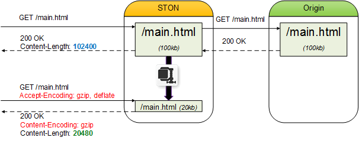

.. _handling_http_requests:

第6章 HTTPリクエスト/レスポンス
******************

.. note::

   - `[動画講座]みよう！ STON Edge Server - Chapter 6圧縮 <https://youtu.be/GZ_NaK2yqk0?list=PLqvIfHb2IlKeZ-Eym_UPsp6hbpeF-a2gE>`_

この章では、HTTPクライアントセッションと要求を処理する方法について説明する。 サービスの主な機能として見るには難しい内容が多いので、頭が痛い必要はない。 一部のHTTPの理解がなければ、難しいことができる部分があるが、このような場合は、デフォルトの設定を使用してほしい。 全体的にデフォルトの設定をそのまま使用してもサービスには全く支障がない内容だ。

.. toctree::
   :maxdepth: 2

.. _handling_http_requests_session_man:

セッション管理
====================================

HTTPクライアントがサーバー（STON）に接続すると、HTTPセッションが生成される。 クライアントは、HTTPセッションを介してサーバーに格納された複数のコンテンツをサービス受ける。 リクエストからレスポンスまでを一つの **HTTPトランザクション** と呼ぶ。 HTTPセッションは、複数のHTTPトランザクションを順次処理する。 ::

   # server.xml - <Server><VHostDefault><Options>
   # vhosts.xml - <Vhosts><Vhost><Options>

   <ConnectionHeader>keep-alive</ConnectionHeader>
   <ClientKeepAliveSec>10</ClientKeepAliveSec>
   <KeepAliveHeader Max="0">ON</KeepAliveHeader>

-  ``<ConnectionHeader> (デフォルト: keep-alive)``
   クライアントに送信するHTTPレスポンスのConnectionヘッダ( ``keep-alive`` または ``close`` )を設定する。

-  ``<ClientKeepAliveSec> (デフォルト: 10秒)``
   クライアントセッションとは何の通信がない状態で設定された時間が経過すると、セッションを終了する。 時間を長すぎる設定すると、通信をしていないセッションが過度に多くなる。 あまりにも多くのセッションを維持するだけでも、システムは負荷となる。

-  ``<KeepAliveHeader>``

   - ``ON (デフォルト)`` HTTP応答にKeep-Aliveヘッダを明示する。
     ``Max (デフォルト: 0)`` を0より大きく設定すると、Keep-Aliveヘッダの値に ``Max`` 値が設定される。 以後HTTPトランザクションが発生するたびに1ずつ減算される。

   - ``OFF`` HTTP応答にKeep-Aliveヘッダを省略する。

HTTPセッションを維持ポリシー
---------------------

STONはなるべくApacheのポリシーに従う。 特にセッション維持ポリシーは、HTTPヘッダーの値に応じた変数が多い。 HTTPセッションを維持政策に影響を与える要素は次のとおりです。

- クライアントのHTTP要求に指定されたConnectionヘッダ（"Keep-Alive" または "Close"）
- 仮想ホスト ``<Connection>`` 設定
- 仮想ホストセッションKeep-Alive時間設定
- 仮想ホスト ``<Keep-Alive>`` 設定

1. クライアントのHTTP要求に "Connection: Close" に設定されている場合 ::

      GET / HTTP/1.1
      ...(省略)...
      Connection: Close

   このようなHTTPリクエストには、仮想ホストの設定の有無にかかわらず、
   "Connection: Close" で応答する。 Keep-Aliveヘッダは設定されない。 ::

      HTTP/1.1 200 OK
      ...(省略)...
      Connection: Close

   このHTTPトランザクションが完了すると、HTTP接続を終了する。

2. ``<ConnectionHeader>`` が ``Close`` に設定された場合 ::

      # server.xml - <Server><VHostDefault><Options>
      # vhosts.xml - <Vhosts><Vhost><Options>

      <ConnectionHeader>Close</ConnectionHeader>

   クライアントのHTTP要求とは関係なく、 "Connection: Close" で応答する。 Keep-Aliveヘッダは設定されない。 ::

      HTTP/1.1 200 OK
      ...(省略)...
      Connection: Close

3. ``<KeepAliveHeader>`` が ``OFF`` に設定された場合 ::

      # server.xml - <Server><VHostDefault><Options>
      # vhosts.xml - <Vhosts><Vhost><Options>

      <ConnectionHeader>Keep-Alive</ConnectionHeader>
      <KeepAliveHeader>OFF</KeepAliveHeader>

   Keep-Aliveヘッダが設定されない。 HTTPセッションは、継続的に再利用可能です。 ::

      HTTP/1.1 200 OK
      ...(省略)...
      Connection: Keep-Alive

4. ``<KeepAliveHeader>`` が ``ON`` に設定された場合 ::

      # server.xml - <Server><VHostDefault><Options>
      # vhosts.xml - <Vhosts><Vhost><Options>

      <ConnectionHeader>Keep-Alive</ConnectionHeader>
      <ClientKeepAliveSec>10</ClientKeepAliveSec>
      <KeepAliveHeader>ON</KeepAliveHeader>

   Keep-Aliveヘッダが設定される。 timeout値は、セッションKeep-Alive時間設定を使用する。 ::

      HTTP/1.1 200 OK
      ...(省略)...
      Connection: Keep-Alive
      Keep-Alive: timeout=10

   .. note::

      < ``<Keep-Alive>`` と ``<ClientKeepAliveSec>`` の関係 >

      ``<Keep-Alive>`` 設定時 ``<ClientKeepAliveSec>`` を参照してますが、 ``<ClientKeepAliveSec>`` は、より根本的な問題と関連がある。 性能や資源的に最も重要な問題は、Idleセッション（= HTTPトランザクションが発生していないセッション）のまとめ視点をとるものです。 HTTPヘッダの設定は動的に変更されたり、時には省略されることがありますがIdleセッションクリーンアップは、はるかに敏感な問題です。 このような理由のために ``<ClientKeepAliveSec>`` は ``<KeepAliveHeader>`` に統合されず、別途存在する。

5. ``<KeepAliveHeader>`` の ``Max`` 属性が設定されている場合 ::

      # server.xml - <Server><VHostDefault><Options>
      # vhosts.xml - <Vhosts><Vhost><Options>

      <ConnectionHeader>Keep-Alive</ConnectionHeader>
      <ClientKeepAliveSec>10</ClientKeepAliveSec>
      <KeepAliveHeader Max="50">ON</KeepAliveHeader>

   Keep-Aliveヘッダにmax値を指定する。 このセッションではmax回使用可能であり、HTTPトランザクションが進むたびに1ずつ減少される。 ::

      HTTP/1.1 200 OK
      ...(省略)...
      Connection: Keep-Alive
      Keep-Alive: timeout=10, max=50

6. Keep-Aliveのmaxが満了した場合、 ::

   上記の設定どおりmaxが設定された場合maxは徐々に減少次のように1まで到達することになる。 ::

      HTTP/1.1 200 OK
      ...(省略)...
      Connection: Keep-Alive
      Keep-Alive: timeout=10, max=1

   この応答は、現在のセッションで、今後1回のHTTPトランザクションの進行が可能である意味です。 このセッションでHTTP要求がもう一度行われる場合は、次のように "Connection: Close"で応答する。 ::

      HTTP/1.1 200 OK
      ...(省略)...
      Connection: Close

クライアントCache-Control 
====================================

クライアントCache-Controlに関連する設定を説明します。

Ageヘッダ
---------------------

Ageヘッダは、キャッシュされた瞬間からの経過時間（秒）を意味し、
`RFC2616 - 13.2.3 Age Calculations <http://www.w3.org/Protocols/rfc2616/rfc2616-sec13.html#sec13.2.3>`_ によって計算される。 ::

   # server.xml - <Server><VHostDefault><Options>
   # vhosts.xml - <Vhosts><Vhost><Options>

   <AgeHeader>OFF</AgeHeader>

-  ``<AgeHeader>``

   -  ``OFF (デフォルト)`` Ageヘッダを省略する。

   -  ``ON`` Ageヘッダを設定する。

Expiresヘッダ
---------------------

Expiresヘッダを再設定する。 ::

   # server.xml - <Server><VHostDefault><Options>
   # vhosts.xml - <Vhosts><Vhost><Options>

   <RefreshExpiresHeader Base="Access">OFF</RefreshExpiresHeader>

-  ``<RefreshExpiresHeader>``

   -  ``OFF (デフォルト)`` オリジンサーバーからの応答したExpiresヘッダをクライアントに指定する。 オリジンサーバーでExpiresヘッダが省略された場合、クライアントの応答もExpiresヘッダが省略される。

   -  ``ON``  Expires条件を反映してExpiresヘッダを明示する。 条件に該当しないコンテンツは、 ``OFF`` の設定と同じように動作する。

Expires条件は、Apacheの `mod_expires <http://httpd.apache.org/docs/2.2/mod/mod_expires.html>`_ と同じように動作する。 特定の条件（URLやMIME Type）に対応するコンテンツのExpiresヘッダとCache-Controlの値を設定することができる。 Cache-Controlのmax-ageの値は設定されたExpires時間で要求された時間を引いた値になる。

Expires条件は/svc/ {仮想ホスト名} /expires.txtに設定する。 ::

   # /svc/www.exmaple.com/expires.txt
   # 区切り文字はカンマ（、）であり、{条件}、{時間}、{基準}順に表記する。

   $URL[/test.jpg], 86400
   /test.jpg, 86400
   *, 86400, access
   /test/1.gif, 60 sec
   /test/*.dat, 30 min, modification
   $MIME[application/shockwave], 1 years
   $MIME[application/octet-stream], 7 weeks, modification
   $MIME[image/gif], 3600, modification

-  **条件**

   URLとMIME Typeの2つに設定が可能です。 URLの場合、$ URL […]で、MIME Typeの場合$ MIME[…]と表記する。 パターン表現が可能であり、$表現が省略された場合は、URLとして認識する。

-  **時間**

   Expires有効期限を設定する。 時間単位の表現をサポートし単位を設定しない場合秒として計算される。

-  **基準**

   Expiresの有効期限の基準時点を設定する。 別途基準時点を指定しなければAccessが基準時点として設定される。 Accessは、現在の時刻を基準とする。 次は、MIME Typeがimage / gifのファイルへのアクセス時間から1日12時間後にExpiresヘッダの値を設定する例です。 ::

      $MIME[image/gif], 1 day 12 hours, access

   Modificationは、オリジンサーバーから送信されたLast-Modifiedを基準とする。 以下はすべてのjpgファイルに対してLast-Modifiedから30分後にExpires値に設定する例です。 ::

      *.jpg, 30min, modification

   Modificationの場合は、計算されたExpires値が現在の時間よりも過去の時間である場合、現在の時刻を指定する。 もしオリジンサーバーで、Last-Modifiedヘッダを提供しない場合Expiresヘッダを送信しません。

ETagヘッダ
---------------------

クライアントに送信するHTTPレスポンスにETagヘッダの設定有無を指定する。 ::

   # server.xml - <Server><VHostDefault><Options>
   # vhosts.xml - <Vhosts><Vhost><Options>

   <ETagHeader>ON</ETagHeader>

-  ``<ETagHeader>``

   -  ``ON (デフォルト)`` ETagヘッダを指定する。

   -  ``OFF``  ETagヘッダを省略する。

デフォルトの応答ヘッダ
====================================

非標準ヘッダ処理
---------------------

パフォーマンスとセキュリティ上の理由でオリジンサーバーからの送信ヘッダー中標準ヘッダのみを選択的に認識する。 ::

   # server.xml - <Server><VHostDefault><Options>
   # vhosts.xml - <Vhosts><Vhost><Options>

   <OriginalHeader>OFF</OriginalHeader>

-  ``<OriginalHeader>``

   -  ``OFF (デフォルト)`` 標準ヘッダではない場合は無視する。

   -  ``ON`` cookie, set-cookie, set-cookie2を除くすべてのヘッダーを保存して、クライアントに送信する。 ただし、メモリとストレージのコストをより消費する。

Viaヘッダ
---------------------

クライアントに送信するHTTPレスポンスへのViaヘッダの設定有無を指定する。 ::

   # server.xml - <Server><VHostDefault><Options>
   # vhosts.xml - <Vhosts><Vhost><Options>

   <ViaHeader>ON</ViaHeader>

-  ``<ViaHeader>``

   - ``ON (デフォルト)`` Viaヘッダを次のように指定する。
     ::

        Via: STON/2.0.0

   - ``OFF``  Viaヘッダを省略する。

Serverヘッダ
---------------------

クライアントへのHTTPレスポンスにServerヘッダの設定有無を指定する。 ::

   # server.xml - <Server><VHostDefault><Options>
   # vhosts.xml - <Vhosts><Vhost><Options>

   <ServerHeader>ON</ServerHeader>

-  ``<ServerHeader>``

   -  ``ON (デフォルト)`` ソースサーバーのServerヘッダを設定する。 ::

   -  ``OFF``  Serverヘッダを省略する。

.. _handling_http_requests_modify_client:

クライアントの要求/応答ヘッダの変更
====================================

クライアントHTTPリクエストとレスポンスを特定の条件に応じて変更する。 ::

   # server.xml - <Server><VHostDefault><Options>
   # vhosts.xml - <Vhosts><Vhost><Options>

   <ModifyHeader FirstOnly="OFF">OFF</ModifyHeader>

-  ``<ModifyHeader>``

   -  ``OFF (デフォルト)`` 変更しません。

   -  ``ON`` ヘッダ変更条件に応じて、ヘッダーを変更する。 

ヘッダ変更時点を正確に理解しましょう。

-  **HTTPリクエストヘッダの変更時点**

   クライアントのHTTP要求を最初に認識した時点でヘッダを変更する。 ヘッダが変更された場合変更された状態でCacheモジュールで処理される。 ただし、HostヘッダとURIは変更できない。

-  **HTTP応答ヘッダーの変更時点**

   クライアントの応答の直前にヘッダを変更する。 ただし、Content-Lengthは変更できない。

ヘッダ変更条件は/ svc / {仮想ホスト名} /headers.txtに設定する。 ヘッダはマルチで設定可能なので条件に一致する場合すべての変更の設定が順次適用される。

最初の条件のみを変更したい場合 ``FirstOnly`` 属性を ``ON`` に設定する。 別の条件が同じヘッダを変更する場合 ``set`` によってLast-Winになったり、明示的に ``put`` ``append`` することができる。 ::

   # /svc/www.example.com/headers.txt
   # 区切り文字はカンマ（、）です。

   # リクエスト変更
   # {Match}, {$REQ}, {Action(set|put|append|unset)} 順に表記する。
   $IP[192.168.1.1], $REQ[SOAPAction], unset
   $IP[192.168.2.1-255], $REQ[accept-encoding: gzip], set
   $IP[192.168.3.0/24], $REQ[cache-control: no-cache], append
   $IP[192.168.4.0/255.255.255.0], $REQ[x-custom-header], unset
   $IP[AP], $REQ[X-Forwarded-For], unset
   $HEADER[user-agent: *IE6*], $REQ[accept-encoding], unset
   $HEADER[via], $REQ[via], unset
   $URL[/source/*.zip], $REQ[accept-encoding: deflate], set
   $METHOD[POST], $REQ[host: sub.example.com], set

   # 応答変更
   # {Match}, {$RES}, {Action(set|put|append|unset)}, {condition} 順に表記する。
   # {condition}は、特定の応答コードに限ってヘッダーを変更することができますが、必須ではない。
   $IP[192.168.1.1], $RES[via: STON for CDN], set
   $IP[192.168.2.1-255], $RES[X-Cache], unset, 200
   $IP[192.168.3.0/24], $RES[cache-control: no-cache, private], append, 3xx
   $IP[192.168.4.0/255.255.255.0], $RES[x-custom-header], unset
   $HEADER[user-agent: *IE6*], $RES[vary], unset
   $HEADER[x-custom-header], $RES[cache-control: no-cache, private], append, 5xx
   $URL[/source/*], $RES[cache-control: no-cache], set, 404
   /secure/*.dat, $RES[x-custom], unset, 200
   /*.mp4, $RES[Access-Control-Allow-Origin: example1.com], set
   /*.mp4, $RES[Access-Control-Allow-Origin: example2.com], put

{Match}はIPアドレス、GeoIP、Header、URL、4つに設定が可能です。

-  **IP**

   $IP[...]で表記しIP、IP Range、Bitmask、Subnet 4種類をサポートします。

-  **GeoIP**

   $IP[...]で表記し必ず :ref:`access-control-geoip` が設定する必要があります。 国コードは、 `ISO 3166-1 alpha-2 <http://en.wikipedia.org/wiki/ISO_3166-1_alpha-2>`_ と `ISO 3166-1 alpha-3 <http://en.wikipedia.org/wiki/ISO_3166-1_alpha-3>`_ をサポートする。

-  **Header**

   $HEADER[Key : Value]と表記する。 Valueは明確な表現とパターンをサポートする。 Valueが省略された場合にはKeyに対応するヘッダの存在の有無を条件に判断する。

-  **URL**

   $URL[...]で表記し省略が可能です。 明確な表現とパターンを認識する。

-  **METHOD**

   $METHOD[...]で表記し、GET、POST、HEAD、OPTIONSのどちらかを明示的に指定する。

{$REQ}と {$RES}は、ヘッダを変更方法を設定する。
``set`` ``put`` ``append`` の場合、{Key：Value}で設定し、Valueが入力されていない場合は、空の値（""）が入力される。
``unset`` の場合、{Key}のみ入力する。

{Action}は ``set`` , ``put`` , ``append`` , ``unset``  4つに設定が可能です。

-  ``set``  要求/応答ヘッダに設定されているKeyとValueをヘッダに追加します。 すでに同じKeyが存在する場合、以前の値を上書きします。

-  ``put``  ( ``set`` と似ているが）同じKeyが存在すれば、上書きせずに新しい行に貼り付けます。

-  ``append`` ( ``set`` と似ているが）同じKeyが存在する場合は、既存のValueと設定されたValueの間にComma（、）で区切って値を結合する。

-  ``unset`` 要求/応答ヘッダに設定されているKeyに対応するヘッダを削除する。 

{Condition}は200や304のような具体的な応答コードのほか2xx、3xx、4xx、5xxのように応答コードの系列の条件に設定する。 {Match}と一致しても{Condition}と一致しない場合変更が反映されない。 {Condition}が省略された場合は応答コードを確認しません。 

.. note::

   ``#PROTOCOL`` キーワードを介してクライアントが要求したプロトコル（httpまたはhttps）をクライアントヘッダに追加することができる。 ::

      $URL[*], $REQ[X-Forwarded-Proto: #PROTOCOL], set

   ``#CACHEHIT`` キーワードを使用して :ref:`adv_topics_req_hit_ratio` の詳細コードをレスポンスヘッダに追加することができる。 ::

      $URL[*], $RES[X-Cache-Result: #CACHEHIT], set

.. _handling_http_requests_compression:

圧縮
====================================
オリジンサーバーの結果コンテンツを圧縮して伝送する。
:ref:`caching-policy-accept-encoding` に基づいてコンテンツを区別するように設定する必要があります。 ::

   Accept-Encoding: gzip, deflate

   非圧縮ファイルをリアルタイムに圧縮して伝送する。

::

   # server.xml - <Server><VHostDefault><Options>
   # vhosts.xml - <Vhosts><Vhost><Options>

   <Compression Method="gzip" Level="6" SourceSize="2-2048">OFF</Compression>

-  ``<Compression>``

   -  ``OFF (デフォルト)`` 圧縮機能を使用しません。

   -  ``ON`` 圧縮機能を使用する。 次のプロパティをサポートします。

      -  ``Method (デフォルト: gzip)`` 圧縮方式を指定する。 gzipのみサポートされる。
      -  ``Level (デフォルト: 6)`` 圧縮レベルを指定します。 この値は、 ``Method`` によって異なる。 gzipは、1〜9までの指定が可能です。 数字が小さいほど高速ですが、圧縮率が悪く、大きいほど遅いが、圧縮率が良い。
      -  ``SourceSize (デフォルト: 2-2048, 単位: KB)`` 元のコンテンツサイズを範囲で指定する。 あまりにも小さなファイルは圧縮率が低下する。 反対に大きすぎるファイルは過度にCPUを占有する場合があります。

圧縮されたコンテンツは、オリジナルと異なるコンテンツとして認識/キャッシュされ、同じ要求の再圧縮されない。 圧縮対象は/svc/{vhost}/compression.txtに指定する。 定義された順序で適用される。 ::

   # /svc/www.example.com/compression.txt
   # 区切り文字はカンマ（、）です。
   # {URL条件}、 {Method}、 {Level}順に表記する。

   /sample.css、 no       // 圧縮しない。
   *.css                 // *.css 条件について 基本 Methodと Levelで 圧縮する。
   *.htm、 gzip           // *.htm htm 条件について gzipで 圧縮する。 (デフォルト Level)
   *.xml、 9            // *.xml 条件について Level 9 に 圧縮する。 (デフォルト Method)
   *.js、 gzip、 5         // *.js 条件について gzip（Level = 5）に圧縮する。

圧縮は、CPUリソースを大量に消費する機能です。 以下はファイルサイズ別GZIP（Level：9）の性能テストの結果です。

-  ``OS`` CentOS 6.3 (Linux version 2.6.32-279.el6.x86_64 (mockbuild@c6b9.bsys.dev.centos.org) (gcc version 4.4.6 20120305(Red Hat 4.4.6-4) (GCC) ) #1 SMP Fri Jun 22 12:19:21 UTC 2012)
-  ``CPU`` `Intel(R) Xeon(R) CPU E5-2603 0 @ 1.80GHz (8 processors) <http://www.cpubenchmark.net/cpu.php?cpu=Intel%20Xeon%20E5-2603%20@%201.80GHz>`_
-  ``RAM`` 8GB
-  ``HDD`` SAS 275GB X 5EA

======================= ========== ======== ============== ========================= ==================
サイズ                    圧縮(%)    スループット  応答速度(ms)    クライアントのトラフィック(Mbps)  元トラフィック(Mbps)
======================= ========== ======== ============== ========================= ==================
1KB                     26.25      5288     6.72           40.58                     55.02
2KB                     57.45      5238     7.20           41.52                     97.58
4KB                     76.94      5236     7.18           42.44                     184.04
8KB                     87.61      5021     7.53           41.87                     337.80
16KB                    93.32      4608     8.30           41.19                     616.83
32KB                    96.26      3495     13.55          34.53                     924.22
64KB                    97.79      1783     24.50          20.71                     938.83
bootstrap.css(20KB)     86.87      3944     9.67           83.79                     638.25
bootstrap.min.js(36KB)  73.00      1791     51.50          139.00                    514.86
======================= ========== ======== ============== ========================= ==================

``<Compression>`` が有効になっている場合は、オリジンサーバーに非圧縮コンテンツだけを要求する。 非圧縮コンテンツはオリジンサーバーにAccept-Encodingヘッダを設定せずに送った時の応答を意味する。 もしオリジンサーバが非圧縮コンテンツ要求に対してContent-Encodingヘッダを設定した場合は既に圧縮されたものとみなして圧縮しません。

.. _handling_http_requests_drm:

DRM
====================================

On-the-flyでコンテンツを暗号化して配信する。 

.. figure:: img/drm1.png
   :align: center

::

   $ server.xml - <Server><VHostDefault><Options>
   $ vhosts.xml - <Vhosts><Vhost><Options>

   <Drm Status="Inactive" Keyword="drm" MaxSourceSize="500">
      <Algorithm>RC4</Algorithm>
      <IV> ... </IV>
      <Token> ... </Token>
      <Key Hash="none">$Token</Token>
   </Drm>

-  ``<Drm>`` DRM方式を設定する。 ``Status="Active"`` に設定されると、活性化される。 サービスアドレスの後ろ ``Keyword`` をsuffixに付けてDRMを駆動する。 ::

      // URL
      www.example.com/music.mp3

      // DRM 処理された URL
      www.example.com/music.mp3/drm

   ``MaxSourceSize (デフォルト: 500 MB)`` を超えるコンテンツについては、500 Internal Errorで処理する。

-  ``<Algorithm> (デフォルト: RC4)`` 
   暗号化アルゴリズムを選択する。 使用可能なアルゴリズムは次の通りです。

   ================== ============
   <Algorithm>        Bits
   ================== ============
   RC4                40 ~ 2048
   ================== ============

-  ``<IV>`` Initial Vector。

-  ``<Token>`` キーの生成に使用されるトークン

-  ``<Key> (デフォルト: $Token)`` 変数を組み合わせて、がん化/復号化に使用されるキーを生成することができる。
   
   ================== ==================================
   変数                説明
   ================== ==================================
   $Token             <Token>の値
   $url               クライアントが要求されたURL 
   $filename1         拡張子を含むファイル名 
   $filename2         拡張子を除いたファイル名 
   ================== ==================================

   コンマ（、）を区切り文字として使用してキーを生成する。 
   
   URLが/music/iu.mp3で ``<Token>`` をABCに仮定すると ``<Key>`` 表現によるがん化/復号化キーは、次のとおりです。
   
   ========================= ==================================
   <Key Hash="none">         がん化/復号化キー
   ========================= ==================================
   $Token                    ABC
   $url,$Token               /music/iu.mp3ABC
   $Token,$filename1         ABCiu.mp3
   $filename2,$Token,$url    iuABC/music/iu.mp3
   ========================= ==================================

   ``Hash (デフォルト: none)`` 属性が ``none`` の場合に組み合わせた文字列を、がん化/復号化キーを使用する。

   ``Hash`` 属性を指定すると、以下のように組み合わせた文字列をハッシュした値をキーとして使用する。 ::

      Hash( iuABC/music/iu.mp3 )

   ``Hash`` 属性は ``none`` 、 ``MD5`` 、 ``SHA-1`` 、 ``SHA-256`` をサポートする。
   

.. note::

   DRM関連の変数( ``<Algorithm>`` 、 ``<IV>`` 、 ``<Token>`` 、 ``<Key>`` ) は、動的に変更できませんので、慎重に設定する必要がある。 以前キーで暗号化されたファイルは新しいキーで復号化できないためです。 したがって、キーを変更する必要がある状況ではその仮想ホストのキャッシュを初期化した後サービスすることが安全です。

    
``<IV>`` と ``<Token>`` を平文（Plain Text）で提供するセキュリティ的に脆弱です。 これ以下のAPIを利用して暗号化した後、設定することを推奨する。 ::

   /command/encryptpassword?plain=abcdefghijklmnop

暗号化された ``<IV>`` 、 ``<Token>`` 設定のために ``Type="enc"`` 属性を追加する。 ::

   $ server.xml - <Server><VHostDefault><Options>
   $ vhosts.xml - <Vhosts><Vhost><Options>

   <Drm Status="Active" Keyword="drm">
      <Algorithm>RC4</Algorithm>
      <IV Type="enc">RokyekMd0IjDnRGKjVE7sQ==</IV>
      <Token Type="enc">x4KHA1b+AirBOIoaeEBHmg==</Token>
      <Key>$Token</Key>
   </Drm>

.. note::

   暗号化APIは、証明書に基づいて動作する。 したがって、証明書が異なる暗号化/復号化の結果が異なっている。

