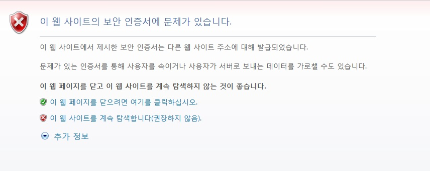

.. _https:

第9章 HTTPS
******************

この章ではHTTPSの構成について説明します。 TLS 1.2をサポートしSSL 2.0はセキュリティ上の理由からアップグレードのみを許可します。 HTTPSはクライアントとSTON区間でのみ使用されます。 STONはオリジンサーバーとHTTPSで通信しません。 なぜならセキュリティ的にも性能的にSTONがHTTPSを中継することは適切でないからです。 もしオリジンサーバーと必ずHTTPSで通信が必要な場合 :ref:`bypass-port` を推奨します。

.. toctree::
   :maxdepth: 2

サービスの構成
====================================

別のIPアドレスまたはポートを指定しない場合デフォルトでバインドされているサービスアドレスは "*:443" です。 グローバル設定（server.xml）に設定します。 ::

   # server.xml - <Server>

   <Https>
      <Cert>/usr/ssl/cert.pem</Cert>
      <Key>/usr/ssl/certkey.pem</Key>
      <CA>/usr/ssl/CA.pem</CA>
   </Https>

   <Https Listen="1.1.1.1:443">
      <Cert>/usr/ssl_ip_port/cert.pem</Cert>
      <Key>/usr/ssl_ip_port/certkey.pem</Key>
      <CA>/usr/ssl_ip_port/CA.pem</CA>
   </Https>

   <Https Listen="*:886">
      <Cert>/usr/ssl_port886/cert.pem</Cert>
      <Key>/usr/ssl_port886/certkey.pem</Key>
      <CA>/usr/ssl_port886/CA.pem</CA>
   </Https>

-  ``<Https>`` HTTPSを構成します。

   -  ``<Cert>`` サーバー証明書

   -  ``<Key>`` サーバ証明書の秘密鍵。 暗号化された形式はサポートしません。

   -  ``<CA>`` CA(Certificate Authority) チェーンの証明書

同じPortをサービスしてもより明確な表現が優先します。

たとえば上記のNICが3個でそれぞれのIPアドレスが1.1.1.11.1.1.21.1.1.3である場合を想定してみよう。 1.1.1.1:443に接続したクライアントは最も明示的な表現である2番目（<Https Listen = "1.1.1.1:443">）証明書にサービスされます。 一方1.1.1.3:443に接続したクライアントはIPが一致する1番目（<Https>Listen = "* ：443"属性が省略されている）証明書にサービスされます。 証明書ファイルを同じ名前で上書きしてもReloadするときに反映されます。

.. note::

   証明書のフォーマットはPEM（Privacy Enhanced Mail）非対称キーアルゴリズムはRSAのみをサポートします。

.. _https-aes-ni:

SSL / TLS加速
====================================

CPU（AES-NI）を介してSSL / TLSを加速します。 AES-NIをサポートしているCPUである場合SSL / TLSでAESアルゴリズムを優先的に使用するように動作します。 AES-NIが認識された場合は次のようにInfo.logに記録されます。 ::

   AES-NI : ON (SSL/TLS accelerated)

管理者はAES-NIを使用有無を選択することができます。 ::

   # server.xml - <Server><Cache>

   <AES-NI>ON</AES-NI>

-  ``<AES-NI> (デフォルト: ON)`` AES-NIを使用有無を選択します。

.. _https-ciphersuite:

CipherSuiteを選択
====================================

サポートしているCipherSuitesは以下の通りである。

================================================ ======== =========== =======
Cipher Suite                                     TLS1.2   TLS1.1/1.0  SSL3.0
================================================ ======== =========== =======
TLS_ECDHE_RSA_WITH_AES_256_GCM_SHA384	(0xc030)   O
TLS_ECDHE_RSA_WITH_AES_256_CBC_SHA384	(0xc028)   O
TLS_ECDHE_RSA_WITH_AES_128_GCM_SHA256	(0xc02F)   O
TLS_ECDHE_RSA_WITH_AES_128_CBC_SHA256	(0xC027)   O
TLS_ECDHE_RSA_WITH_AES_256_CBC_SHA (0xC014)      O        O
TLS_ECDHE_RSA_WITH_AES_128_CBC_SHA (0xC013)      O        O
TLS_RSA_WITH_AES_256_GCM_SHA384	(0x009D)         O
TLS_RSA_WITH_AES_128_GCM_SHA256	(0x009C)         O
TLS_RSA_WITH_AES_256_CBC_SHA256	(0x003D)         O
TLS_RSA_WITH_AES_128_CBC_SHA256	(0x003C)         O
TLS_RSA_WITH_AES_256_CBC_SHA (0x0035)            O        O
TLS_RSA_WITH_AES_128_CBC_SHA (0x002F)            O        O
TLS_RSA_WITH_3DES_EDE_CBC_SHA (0x000A)           O        O
TLS_RSA_WITH_RC4_128_SHA (0x0005)                                     O
TLS_RSA_WITH_RC4_128_MD5 (0x0004)                                     O
================================================ ======== =========== =======

``<Https>`` の ``CipherSuite`` 属性を使用すると使用CipherSuiteを設定することができます。 ::

   # server.xml - <Server>

   <Https CipherSuite="ALL:!ADH:RC4+RSA:+HIGH:+MEDIUM:+LOW:+SSLv2:+EXP">
      <Cert>/usr/ssl/cert.pem</Cert>
      <Key>/usr/ssl/certkey.pem</Key>
      <CA>/usr/ssl/CA.pem</CA>
   </Https>

-  ``CipherSuite`` `Apache mod_sslの SSL CipherSuite表現 <http://httpd.apache.org/docs/2.2/mod/mod_ssl.html#sslciphersuite>`_ に続く。

`Forward Secrecy <https://en.wikipedia.org/wiki/Forward_secrecy>`_ を保証するより高い安全性を得ることができます。 （下のリンク参照）

   - `SSL Labs: Deploying Forward Secrecy <https://community.qualys.com/blogs/securitylabs/2013/06/25/ssl-labs-deploying-forward-secrecy>`_
   - `SSL/TLS & Perfect Forward Secrecy <http://vincent.bernat.im/en/blog/2011-ssl-perfect-forward-secrecy.html>`_
   - `Configuring Apache, Nginx, and OpenSSL for Forward Secrecy <https://community.qualys.com/blogs/securitylabs/2013/08/05/configuring-apache-nginx-and-openssl-for-forward-secrecy>`_

デフォルト的には FS（Forward Secrecy）を保証するCipherSuiteを優先的に選択します。 ::

   # server.xml - <Server>

   <Https FS="ON"> ...  </Https>

-  ``FS``

   - ``ON (デフォルト)`` Forward Secrecyを保証するCipherSuiteを優先的に選択します。
   - ``OFF`` ClientHelloに記載順に選択します。

``FS`` 属性は ``CipherSuite`` 属性よりも優先します。

.. note::

   パフォーマンス上の理由からECDHEのみをサポートします。 DHEは対応しません。

.. _https-ciphersuite-query:

CipherSuite照会
====================================

CipherSuite設定結果を照会します。 CipherSuite式は `OpenSSL 1.0.0E <https://www.openssl.org/docs/apps/ciphers.html>`_ を遵守します。 ::

   http://127.0.0.1:10040/monitoring/ssl?ciphersuite=...

結果はJSON形式で提供されます。 ::

  {
      "version": "2.0.0",
      "method": "ssl",
      "status": "OK",
      "result":
      [
          {
              "Name" : "AES128-SHA",
              "Ver" : "SSLv3",
              "Kx" : "RSA",
              "Au" : "RSA",
              "Enc" : "AES(128)",
              "Mac" : "SHA1"
          },
          {
              "Name" : "AES256-SHA",
              "Ver" : "SSLv3",
              "Kx" : "RSA",
              "Au" : "RSA",
              "Enc" : "AES(256)",
              "Mac" : "SHA1"
          }
      ]
  }

マルチDomain構成
====================================

一台のサーバーで複数のサービスを同時に運用する場合はSSLの設定が問題になります。 ほとんどのWeb / CacheサーバはHTTPリクエストのHostヘッダを見てどの仮想ホストでサービスするか決定します。

.. figure:: img/ssl_alert.png
   :align: center

   一般的なHTTPS通信

一般的にSSLはクライアント（Browser）が自分が接続しようとするサーバーのドメイン名（winesoft.co.kr）を証明書を使用して確認すること身元確認をします。 もし証明書で身元確認ができない場合（無効な証明書または有効期間満了など）は次のようにユーザーに信頼有無を確認します（最初から遮断する場合もある）。 信頼有無はクライアントが選択するので通常の身元確認にならなくても続行したい場合はSSL通信が行われる。

   ユーザーに判断を任せる。

サーバーでSSLを使用する仮想ホストが一つであれば問題にならない。 しかし複数の仮想ホストを同時に運営するサーバーでは問題になります。 サーバーがクライアントに証明書を転送するときに（"一般HTTPS通信"の "2.証明書伝達") クライアントがどのようなHostに接続しようとして知ることができないからです。

この問題を解決する代表的な方法は次のとおりになります。

=================== =========================================== ========================================================================
方式	               利点	                                        欠点
=================== =========================================== ========================================================================
SNI                 サーバーの設定だけで動作（標準）                         Windows XPとIE6非対応
Multi Certificate	証明書のみ交換して動作                               メインドメインまたはサービス主体が同じこと
Multi Port          ポート変更して動作                                WebページからのHTTPSポートを設定する必要がある
Multi NIC	       サーバーの設定だけで動作（最も広く使わ）            NICとIPの追加構成が必要
=================== =========================================== ========================================================================

.. _https_sni:

SNI (Server Name Indication)
--------------------------

SSL / TLSの `SNI(Server Name Indication) <http://en.wikipedia.org/wiki/Server_Name_Indication>`_
拡張フィールドを使用する方式です。 この方式はクライアントがサーバーにSSL接続を要求するときServer Name拡張フィールドを明示することで可能です。 ::

   # server.xml - <Server><Cache>

   <HttpsSNI>OFF</HttpsSNI>

-  ``<HttpsSNI>``

   - ``OFF (デフォルト)`` `Multi Port`_ または `Multi NIC`_ 方法で複数の証明書をサポートします。。

   - ``ON`` のようなIP + Portの組み合わせで複数の証明書をサポートします。 以下の場合のようにポート443で複数の証明書をサポートすることができます。 ::

      # server.xml - <Server>

      <Https>
         <Cert>/usr/ssl/cert.pem</Cert>
         <Key>/usr/ssl/certkey.pem</Key>
         <CA>/usr/ssl/CA.pem</CA>
      </Https>

      <Https>
         <Cert>/usr/ssl_another/cert.pem</Cert>
         <Key>/usr/ssl_another/certkey.pem</Key>
         <CA>/usr/ssl_another/CA.pem</CA>
      </Https>

``<HttpsSNI>`` は動的に変更が不可能です。 設定の変更後は必ずサービスを再起動する必要があります。

.. note::

   SNIは2003年6月 `RFC 3546 <https://tools.ietf.org/html/rfc3546#page-8>`_ を介してTLS 1.0以降でのみ定義された。 したがってSSL v3ではSNIをサポートしていません。 参考までにOpenSSLのs_clientにSSL-3.0オプションを適用するとSNI拡張フィールドを送信しません。

現在までで最もエレガントな方法ですがいくつかの古いクライアントでサポートされません。 以下はSNIをサポートしていないクライアントのリストです。 （出典: `Wikipedia - Server Name Indication <http://en.wikipedia.org/wiki/Server_Name_Indication#Client_side>`_ )

- Internet Explorer (any version) on Windows XP or Internet Explorer 6 or earlier
- Safari on Windows XP
- BlackBerry Browser
- Windows Mobile up to 6.5
- Android default browser on Android 2.x[34] (Fixed in Honeycomb for tablets and Ice Cream Sandwich for phones)
- wget before 1.14
- Java before 1.7

Multi Certificate
--------------------------

証明書に複数のドメインを入れたりWildcard(i.e. *.winesoft.co.kr)を明示して1つの証明書で複数のドメインの身元を確認することができる方法です。

.. figure:: img/faq_ssl2.jpg
   :align: center

   一つの証明書で複数Domainを認証します。

サービス主体が同じなら効果的な方法ですが無関係であれば同じ証明書を共有することは現実的に困難です。 この方法は証明書のみを交換すればれるものなのでSTONで個別に設定することはない。
[ `DigiCert <http://www.digicert.com/wildcard-ssl-certificates.htm>`_ 参考]

Multi Port
--------------------------

SSL / TLSはポート443を使用します。 重複していないポートを利用して証明書を複数インストールすることができます。 クライアントでは次のようにポートを明示することによりSSL通信が可能です。 ::

    https://winesoft.co.kr:543/

STONでは次のようにListen属性にポートを明示して証明書を複数に設定します。 ::

   # server.xml - <Server>

   <Https> ..A社 の証明書.. </Https>
   <Https Listen="*:543"> ..B社 の証明書.. </Https>
   <Https Listen="*:544"> ..C社 の証明書.. </Https>

この方法は最も経済的ではあるがすべてのWebページへのリンクにHTTPSポートを指定しなければなら問題があります。

Multi NIC
--------------------------

サーバーのNICが複数で構成されている場合NICごとにIPアドレスを個別に割り当てることができます。 したがってサーバーのIPごとに個別の証明書をインストールしてクライアントが接続したサーバーのIPに基づいて証明書を決定するように設定します。 STONでは次のようにListen属性にIPアドレスを明示して証明書を複数に設定します。 ::

   # server.xml - <Server>

   <Https Listen="10.10.10.10"> ..A社 の証明書.. </Https>
   <Https Listen="10.10.10.11"> ..B社 の証明書.. </Https>
   <Https Listen="10.10.10.12"> ..C社 の証明書.. </Https>

この方法は最も一般的に使用される方式です。

.. note::

   設定を共有するとIPアドレスのために問題になることができます。 このような場合はIPの代わりにNICの名前に設定します。 ::

      # server.xml - <Server>

      <Https Listen="eth0"> ... </Https>
      <Https Listen="eth1"> ... </Https>
      <Https Listen="eth2"> ... </Https>

プロトコルの設定
====================================

``<Https>`` にプロトコルを構成します。 ::

   # server.xml - <Server>

   <Https TLS1.2="ON" TLS1.1="ON" TLS1.0="ON" SSL3.0="ON"> ...  </Https>

- ``TLS1.2 (デフォルト: ON)`` TLS1.2を使用します。

- ``TLS1.1 (デフォルト: ON)`` TLS1.1を使用します。

- ``TLS1.0 (デフォルト: ON)`` TLS1.0を使用します。

- ``SSL3.0 (デフォルト: ON)`` SSL3.0を使用します。

.. _https-hsts:

HSTS
====================================

`HSTS(HTTP Strict Transport Security) <https://en.wikipedia.org/wiki/HTTP_Strict_Transport_Security>`_ は
:ref:`handling_http_requests_modify_client` を利用して簡単に実装が可能です。
::

   # /svc/www.example.com/headers.txt

   *, $RES[Strict-Transport-Security: max-age=31536000; includeSubDomains], set

`Qualys SSL Server Test <https://www.ssllabs.com/ssltest/>`_ ではHSTSが適用されたサイトにのみA +の評価を与えている。

.. figure:: img/qualys_a_plus.png
   :align: center

   STON v2.2からA +を受けることができる。
