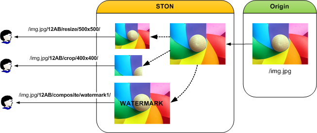

.. _media-dims:

第17章 画像/ DIMS
******************

.. note::

   - `[動画講座]みよう！ STON Edge Server - Chapter 4. リアルタイム画像処理  <https://youtu.be/Pdfe-HbtXVs?list=PLqvIfHb2IlKeZ-Eym_UPsp6hbpeF-a2gE>`_

この章では、画像を転送時点でon-the-flyに変換/転送するDIMS（ディムス）について取り上げる。 DIMS（Dynamic Image Management System）は、元の画像を様々な形に加工する機能である。

   様々な動的な画像加工

画像は、動的に生成され、元の画像のURLの後ろに約束されたキーワードと加工オプションを付けて呼び出します。 加工された画像は、キャッシュされて、元のサーバーのイメージが変わらない以上、再加工されない。

たとえば、元のファイルが/img.jpgなら、次のような形式で画像を加工することができる。
("12AB"は、約束されたKeywordある。) ::

   http://image.example.com/img.jpg    // 原本イメージ
   http://image.example.com/img.jpg/12AB/optimize
   http://image.example.com/img.jpg/12AB/resize/500x500/
   http://image.example.com/img.jpg/12AB/crop/400x400/
   http://image.example.com/img.jpg/12AB/composite/watermark1/

``<Dims>`` は別に設定しなければ、すべて無効にされている。 ::

   # server.xml - <Server><VHostDefault><Options>
   # vhosts.xml - <Vhosts><Vhost><Options>

   <Dims Status="Active" Keyword="dims" MaxSourceSize="10" OnFailure="message" />

-  ``<Dims>``

   - ``Status`` DIMS有効 ( ``Active`` または ``Inactive`` )
   - ``Keyword`` ソースとDIMSを区別するキーワード 
   - ``MaxSourceSize (デフォルト: 10MB)`` 変換を可能にする最大元の画像サイズ（単位：MB）
   - ``OnFailure`` 画像変換失敗時の動作方式

     - ``message (デフォルト)`` 500 Internal Errorで応答する。 本文には、具体的な失敗の理由を明示する。

       - ``The original file was not successfully downloaded.`` 元の画像を完全にダウンロードできなかった。
       - ``The original file size is too large.`` 元画像のサイズが ``MaxSourceSize`` を超えて変換していなかった。
       - ``The original file loading failed.`` 元の画像データを読み込まなかった。
       - ``Image converting failed or invalid DIMS command.`` 正しくない命令またはサポートされていない画像などが原因で変換していなかった。

     - ``redirect`` 元の画像のアドレスに302 Redirectする。

.. toctree::
   :maxdepth: 2

最適化
====================================

最適化とは、イメージの品質を低下させずに、画像を圧縮する過程である。 JPEG、JPEG-2000、Loseless-JPEG画像のみをサポートが可能である。 既に他のツールなどを使用して最適化された画像は、もはや最適化されない。 ::

   http://image.example.com/img.jpg/dims/optimize

最適化は、キーワード以外の別のオプションを持たない。 したがって、他の変換条件と組み合わせたときに一番後ろ明示した方が望ましい。 ::

   http://image.example.com/img.jpg/dims/resize/100x100/optimize

他のすべてのDIMSの機能がシステムリソースを大量に使用しますが、その中でも最適化が最も重い作業である。 以下は、HitRatioが0％の状態で、画像サイズ別パフォーマンステストの結果である。

-  ``OS`` CentOS 6.2 (Linux version 2.6.32-220.el6.x86_64 (mockbuild@c6b18n3.bsys.dev.centos.org) (gcc version 4.4.6 20110731 (Red Hat 4.4.6-3) (GCC) ) #1 SMP Tue Dec 6 19:48:22 GMT 2011)
-  ``CPU`` `Intel(R) Xeon(R) CPU E3-1230 v3 @ 3.30GHz (8 processors) <http://www.cpubenchmark.net/cpu.php?cpu=Intel+Xeon+E3-1230+v3+%40+3.30GHz>`_
-  ``RAM`` 16GB
-  ``HDD`` SMC2108 SAS 275GB X 3EA

====== ======= ============= ======================= ================== ================
サイズ 처리량  응답속도(ms)  클라이언트 트래픽(Mbps) 원본 트래픽(Mbps)  트래픽 절감률(%)
====== ======= ============= ======================= ================== ================
16KB   720     19.32         46.32                   92.62              49.99
32KB   680     20.68         86.42                   165.08             47.65
64KB   285     50.16         80.67                   150.96             46.56
128KB  274     57.80         164.35                  276.52             40.56
256KB  210     80.74         99.42                   432.35             77.00
512KB  113     156.18        160.54                  436.04             63.18
1MB    20      981.07        90.62                   179.88             49.62
====== ======= ============= ======================= ================== ================

約50％内外のトラフィックを削減がでいるのでで非常に有効である。最適化は非常に重い作業である。 参照表でわかるように、画像サイズが最大の変数となる。

そのため、十分な検討なしにサービスに適用たあとは大きな床を見ることができる。 適切な :ref:`adv_topics_req_hit_ratio` がある状況が望ましいが、そうでない場合はサービスの規模に合わせて、物理的なCPUリソースを十分に確保しなければならない。

.. note::

   メタ情報のみを削除したい場合は、以下のコマンドを使用する。 ::

      http://image.example.com/img.jpg/dims/strip/true

カット
====================================

左上を基準にしたい領域だけの画像を切り取る。 領域は、 **width x height{+-}x{+-}y {@} {!} {<} {>}** で表現する。
基本的には画像の横と縦の最大値を使用する。 画像を拡大または縮小しても、アスペクト比は維持される。 正確に指定したサイズで画像を調整するときは、サイズの後ろに感嘆符（！）を追加します。
**640X480!** という表現は正確に640x480サイズのThumbnailを生成するという意味である。 もし、水平方向または垂直方向のサイズのみ指定した場合、省略された値は、水平/垂直比によって自動的に決定される。

例えば、 **/thumbnail/100/** は横幅に合わせて縦サイズが決定され、
**/thumbnail/x200/** は、縦サイズに合わせて横幅が決定される。 水平/垂直サイズを画像のサイズに合わせて割合（％）で表現することができる。 画像のサイズを増やすには、100よりも大きい値（例えば、125％）を使用する。 画像のサイズを小さくするには、100未満の割合を使用する。 URL Encodingルールに基づいて％の文字が％25にエンコードされることを覚えておかなければならない。

例えば、50％という表現は、50％、25でエンコードされる。 以下は、width = 78、height = 110サイズのThumbnailを生成する例である。 ::

   http://image.example.com/img.jpg/dims/thumbnail/78x110/

Resizing
====================================

画像のサイズを変更する。
サイズは **width x height** で表現する。
画像は変更されても比率は維持される。 以下は、元の画像をwidth = 200、height = 200サイズに変更する例である。 ::

   http://image.example.com/img.jpg/dims/resize/200x200/

その他のコマンドは、次のとおりである。

-  **resizec** - 縮小するとresizeと同じですが、拡大すると、画像は維持されて、キャンバスサイズだけ拡大される。
-  **extent** - キャンバスのみ調節するコマンドです。 縮小するとcropと同じ効果を出すが、拡大するとresizecと同じように拡大される。 
-  **trim** - 上下左右の白い背景を削除する。

Format 変更
====================================

画像フォーマットを変更する。
サポートされるフォーマットは、 "png", "jpg", "gif" である。
 以下は、JPGをPNGへ変換する例である。 ::

   http://image.example.com/img.jpg/dims/format/png/

品質変更
====================================

画質を調節する。 この機能は、送信される画像の容量を減らすことができて有効である。 有効範囲は0から100までだ。 次は、画像の品質を25％に調節する例である。 ::

   http://image.example.com/img.jpg/dims/quality/25/

エフェクト
====================================

画像にさまざまなエフェクトを与えることができる。

================ ===================== =================
説明               コマンド                   変数 
================ ===================== =================
反転               invert                true または false
グレースケール        grayscale            true または false
反転            flipflop             vertical
明るさの調整            bright                0 ~ 100
回転               rotate                0 ~ 360 (度)
セピア              sepia                 0 ~ 1
角ラウンド        round                 0 ~ 90
================ ===================== =================

合成
====================================

二つの画像を合成する。 前述の機能とは別の方法で合成条件は、あらかじめ設定されてなければならない。 主にウォーターマーク効果を出すために使用される。 ::

   # server.xml - <Server><VHostDefault><Options>
   # vhosts.xml - <Vhosts><Vhost><Options>

   <Dims Status="Active" Keyword="dims" port="8500">
      <Composite Name="water1" File="/img/small.jpg" />
      <Composite Name="water2" File="/img/medium.jpg" Gravity="se" Geometry="+0+0" Dissolve="50" />
      <Composite Name="water_ratio" File="/img/wmark_s.png" Gravity="s" Geometry="+0+15%" Dissolve="100" />
   </Dims>

-  ``<Composite>``

    画像合成条件を設定する。 属性によって決まり、別の値を持たない。

    -  ``Name`` 呼び出される名前を指定します。
       '/'文字は入力できない。
       URLの "/composite/" の後に位置する。

    -  ``File`` 合成する画像ファイルのパスを指定する。

    -  ``Gravity (デフォルト: c)`` 合成する位置は、左上から9つのポイント(nw, n, ne, w, c, e, sw, s, se)が存在する。

       .. figure:: img/conf_dims2.png
          :align: center

          Gavity 基準点

    -  ``Geometry (デフォルト: +0+0)`` ``Gravity`` 基準で合成する画像の位置を設定する。 {+ - } x {+ - } y。 赤丸はGravity属性に基づいて+ 0 + 0が意味する基準点に+ x + yの値が大きくなるほど画像の中に配置される。 緑の矢印は、+ x、紫の矢印は+ yが増加する方向である。 -xyを使用すると、対象画像の外側に位置するようにされ、結果の画像は見られない。 この属性は、多少複雑に見えますが、画像のサイズを自動的に計算して配置するので、一貫性のある結果を得ることができて有効である。 また、+ x％+ y％のように％オプションを与え割合で配置することもできる。

    -  ``Dissolve (デフォルト: 50)`` 合成する画像の透明度(0~100).

``<Composite>`` を設定した場合 ``Name`` プロパティを使用して画像を合成することができる。 ::

    http://image.example.com/img.jpg/dims/composite/water1/

オリジンの画像の条件判断
====================================

元の画像の条件に応じて動的に加工オプションを別の方法で適用することができる。 たとえば1024 X 768以下の画像は、品質を50％に落とし、それ以上の画像は、1024 X 768にサイズ変換をするには、次のように ``<ByOriginal>`` を設定する。 ::

   # server.xml - <Server><VHostDefault><Options>
   # vhosts.xml - <Vhosts><Vhost><Options>

   <Dims Status="Active" Keyword="dims" port="8500">
      <ByOriginal Name="size1">
         <Condition Width="1024" Height="768">/quality/50/</Condition>
         <Condition>/resize/1024x768/</Condition>
      </ByOriginal>
   </Dims>

-  ``<ByOriginal>``
   ``Name`` 属性で呼び出します。 サブさまざまな条件の ``<Condition>`` を設定する。

-  ``<Condition>``
   条件に満足している場合、設定された変換を実行する。

   - ``Width`` 幅が設定値よりも小さい場合に適用される。
   - ``Height`` 縦の長さが設定値よりも小さい場合に適用される。

   条件を設定しないと、元の画像のサイズに関係なく、変換される。

``<Condition>`` は指定された順序で適用される。 したがって、小さな画像の条件を最初に配置しなければならない。 次のように呼び出したら原本イメージの大きさに準じて合成が適用されます。 ::

   http://image.example.com/img.jpg/dims/byoriginal/size1/

別の例として、画像サイズに応じて、他の ``<Composite>`` 条件を与えることができる。 このような場合は、次のように事前に定義された ``<Composite>`` の ``Name`` に設定する。 ::

   # server.xml - <Server><VHostDefault><Options>
   # vhosts.xml - <Vhosts><Vhost><Options>

   <Dims Status="Active" Keyword="dims" port="8500">
      <Composite Name="water1" File="/img/small.jpg" />
      <Composite Name="water2" File="/img/medium.jpg" Gravity="se" Geometry="+0+0" Dissolve="50" />
      <Composite Name="water3" File="/img/big.jpg" Gravity="se" Geometry="+10+10" Dissolve="50" />
      <ByOriginal Name="size_water">
         <Condition Width="400">/composite/water1/</Condition>
         <Condition Width="800">/composite/water2/</Condition>
         <Condition>/composite/water3/</Condition>
      </ByOriginal>
   </Dims>

次のように呼び出すと、元の画像のサイズに応じて、合成が適用される。 ::

   http://image.example.com/img.jpg/dims/byoriginal/size_water/

.. _media-dims-anigif:

Animated GIF
====================================

Animated GIFにもすべてのDIMS変換が同様に適用される。 処理順序は次のとおりである。

1. Animated GIFを別途のイメージに分解する。
2. それぞれの画像を変換する。
3. 変換された画像をAnimated GIFに結合する。

結合された画像が多いほど処理コストが高く、サービスの品質が低下することができる。 このような場合、最初の画像にのみ変換するように設定すると、処理コストを下げることができる。 ::

   # server.xml - <Server><VHostDefault><Options>
   # vhosts.xml - <Vhosts><Vhost><Options>

   <Dims FirstFrameOnly="OFF" />

-  ``FirstFrameOnly (デフォルト: OFF)`` ONの場合Animated GIFの最初のシーンだけを変換する。

次のようにURLを呼び出すときに ``FirstFrameOnly`` オプションを明示的に指定することができる。 ::

   http://image.example.com/img.jpg/dims/firstframeonly/on/resize/200x200/
   http://image.example.com/img.jpg/dims/firstframeonly/off/resize/200x200/

上記のように、URLに明示的に指定されている場合、設定よりも優先される。 
コメント 

.. note::

   ``limit`` ンドを使用してAnimated GIFのフレーム数を調節することができる。 ::
      
      http://image.example.com/img.jpg/dims/limit/3
      http://image.example.com/img.jpg/dims/limit/3/resize/200x200

その他
====================================

以上の基本的な機能を組み合わせて、複合的なイメージ処理を行うことができる。 たとえばThumbnail生成（78x110）は、フォーマットをJPGからPNGに変換すると、品質の50％以上のオプションを一度の呼び出しで実行することができる。 ::

   http://image.example.com/img.jpg/dims/thumbnail/78x110/format/png/quality/50/

DIMSは、URLを利用して、画像加工が行われる。 したがって、URLに影響を与える他のオプションのために望ましくない結果が得られないように注意しなければならない。

-  :ref:`caching-policy-applyquerystring` が ``OFF`` であれば、キーワード前のQueryStringが無視される。 ::

      http://image.example.com/img.jpg?session=5234&type=37/dims/resize/200x200/

   上記のような呼び出しに、この設定が ``ON`` であれば、入力されたURLのまま認識され ``OFF`` であれば、次のように認識される。 ::

      http://image.example.com/img.jpg/dims/resize/200x200/

-  :ref:`caching-policy-casesensitive` が ``OFF`` であれば、すべてのURLを小文字に変換して処理する。 したがって、DIMSキーワードに大文字が含まれている場合、キーワードを認識していない。 常にキーワードは小文字で使用するのがよい。
