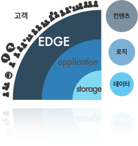

.. _intro:

第1章。 STONエッジサーバー（Edge Server）
**********************************

.. toctree::
   :maxdepth: 2

サービス設計の原則
===================
サービスの成功は、可用性、速度、拡張性にかかっています。 「拡張性、Web アーキテクチャ と分散システムの設計」を書いた Kate Matsudaira もこの 3 つの原則を強調しています。

**可用性 (availability)**

サービスは、常に可能でなければならない。 障害発生時の 90%のお客様は、競合他社に移動す
る。 完全なシステムはないが、障害時の回復は迅速なければならない。

**速度 (speed)**

ビジネスでの時間は金であります。 遅い応答時間は、売上高の減少になる。 応答時間が 0.1 秒 の遅延と、売上高 1%が減少する。 Amazon.com の顧客 47%は、Web ページが 2 秒以内に開か れることを望みます。

**拡張性 (scalability)**

顧客は万人でも一人でもサービスはスムーズなければならない。 サイズを育て維持する努力、 ストレージ拡張性、トランザクション処理余力も拡張性であります。 管理の拡張性欠かせな い。 診断、問題を理解し、アップデートと変更が容易でなければならない。

すべての原則は、最小のコストで守る収録効率的です。 費用はお金だけではなく、時間、努 力、訓練なども含んでいます。

成功サービスは 急成長する。 より多くの顧客とより多くのコンテンツに対処しなければならな い。 成長すればするほどの原則は、より守るのは難しい。 どのようにすれば、この原則を簡単 に最小のコストで守ることができるだろうか?

サービスの成長
===============

テストやパイロットサービスは一・二台のサーバーで開始する。 サービスが少しずつ成長して います。 サーバーの数は、徐々に増える。 コンテンツの更新は一台ずつ入念にしなければなら ない。 まだ力技で何とかできます。

サービスが成長し始めています。 顧客が増え、積むデータがますます大きくなる。 サーバーをいちいち管理することも難しくなる。 データを一箇所に集める高コストのストレージを導入する(NAS、SAN、DAS など)。 高コストであるが、信頼することができるようだ。 コンテンツ更新が容易になった。 ストレージにあげたコンテンツは、サーバー側に自動的に更新される。

サービスが成長してる。 サーバー台数が増えてストレージの転送負荷が大きくなった。 より速いストレージはとても高価であります。 導入をためらわれる。 投資する価値があるか。

同期（synchronization）ソリューションを検討する。 サーバーにデータ全体を準備することは できない。ストレージのコンテンツを選別しなければならない。 正確に制御するには、高度な 管理技術が必須だ。 少ない台数のサーバーの同期管理は簡単だ。 ただし、サーバーとファイル 数が増えるほど難しくなる。 ますます状況は悪化される。 大きくなるほど遅くなり、難しく不 安定でなる。

コンテンツは速い速度で変わる。 追加、削除、ファイルが多くなるほど、同期時間は長くなる。 サービスの規模が大きくなるほど、同期管理システムも同然に大きくなって複雑になる。 管理システムの障害は、すぐに全体の障害を起こす。

コンテンツを迅速かつ柔軟に転送する簡単な方法が必要になる。

.. _intro_service_scaling:

サービス拡張性と配信
=====================

階層化（layering）にサービスをモデル化すると、次の図のように、2 層に分かれます。

.. figure:: img/intro_2layers.png
   :align: center

中心にデータを管理するストレージ(storage)の層があります。 その上にサービスロジックが 実装されたアプリケーション(application)階層があります。 アプリケーション層は、小規模 顧客向けコンテンツ配信も処理することができる。 初期には、ストレージとアプリケーション 層のみでサービスを構成することができる。

.. figure:: img/intro_graph_1.png
   :align: center

サービスが成長し処理費用は変わる。 初期にはロジックの開発が、成長期には、顧客の増加とともに、データ管理が最も多くの費用を占めています。 サービスが発展するほど最大の悩みは、 **コンテンツ配信** であります。 爆発する帯域幅をどのように解決するのか?  **コンテンツ配信** は、サービス増設(Scale-out)の大きな課題になる。

エッジ（edge）：トランスポート層
==========================

サービスが成長ほど、転送の負担は指数的に増加する。 ショッピングモールのコンテンツ数は 多ければ数十億個に達する。 動画サービスのコンテンツは、TB に達して久しい。 サービスの 増設には、 コンテンツ配信の拡張性(scalability)を考慮する必要があります。

エッジ(edge)は、サービスの最も外側、最前方を指す。 エッジでは、顧客は、サービスの応 答速度を体験します。 顧客が要求しているコンテンツは、「必ず」応答する必要があります。 壊れたエラー画像・接続不能は非常に致命的になります。 エッジでコンテンツ配信を処理する と、アプリケーションとストレージの転送負担は減る。

エッジの拡張が効率的であれば、他の高コストの層を増設する必要がない。 ストレージとアプ リケーションの増設は、高コストの非効率的選択であります。

STON エッジサーバーは、以下の方法で迅速・簡単なコンテンツ配信を実現します。

エッジサーバーの動作:キャッシュ（cache）
=========================================

.. figure:: img/intro_cache1.png
   :align: center

送信の規模は、顧客の数とコンテンツのサイズに比例して大きくなる。 どのように多くの顧客がどのようなコンテンツを要求していることは、エッジで最も早く知ることができる。 エッジから Bottom-up の処理の流れが効率的であります。 したがってエッジサーバーは、顧客の要求に応じて On-demand で動作する **キャッシュ(cache)** 伝送方式を採用した。 管理システムもいりません。具体的な動作は以下の通りです。

.. figure:: img/intro_cache2.png
   :align: center

エッジサーバーは、最初のコンテンツ転送要求を受けたとき、元の階層からコンテンツを取得 し、顧客に送信する。 このコンテンツをエッジサーバーは、自分にも保存する。 第二の要求と その後は保存されたコンテンツを、顧客にすぐに送信する。 保存されたコンテンツは、設定さ れた TTL(Time-To-Live)時間だけ有効であります。

エッジサーバーは、これらの方法でかなりの量のコンテンツ配信を処理することができる。 ア プリケーションとストレージの増設を最小限に抑えながら、高速大容量伝送を処理する。 成長 するサービスであれば、必ずエッジを考慮する。

STON エッジサーバーは、無制限/無依存環境を志向するソフトウェアです。 多様なハードウェ アにインストールなろう、最大のパフォーマンスを発揮するように設計されています。

**CPU:** Many-Core に最適化された。 Throughput は、コア数に比例する。

**Memory:** が多ければ多いほど高速に処理する。 Disk I / O を削減する。

**Disk:** を均等に分散する。 より多くのデータを caching する。

**NIC:** 4Gbps NIC Bonding または 10Gbps NIC の Bandwidth を保証する。

STON エッジサーバーは、 **強力な実時間監視/ログ** をサポートします。 秒単位のリアルタイム統計にすぐサービスの状態がどうかを確認することができる。 JSON、XML、SNMP などのいくつかの汎用フォーマットでリアルタイムの数値を提供する。

STON は、管理者のための **簡単な設定** を提供する。 STON の設計理念は、管理者のためのエッジサーバーであります。 Web Management ページを使用して、直感的な設定方法を提供する。 ディテールの設定を希望する場合、単 2 つの XML 設定ファイルに簡単にすることができる。

エッジサーバーの影響
======================
エッジサーバーの効果は次の通りであります。

#. 簡単で便利なサービス加速
#. サービスのソースを外部から保護 (Origin Shielding)
#. サービスが重要な役割を実行することができるよう補助

エッジサーバーの影響は、次の適用事例を中心にも確認することができる。

Game
----------------------------

伝統的に、ゲームサービスは、信じられないほど多くの帯域幅を必要とする。 「大作」 のゲームから簡単なカジュアルゲームまで種類も非常に多様であります。 特にスマートフォンゲームの爆発的な成長は、サービス形態をより多様にした。

.. figure:: img/icons_game.png
   :align: center

- **高い帯域幅**

  単一のサーバーで高帯域幅を得る従来の方法は、1Gbps NIC をボンディング(Bonding)するものであります。 これにより、4Gbps の帯域幅まで得ることができる。 最近 10Gbps NIC も市場に多く普及している傾向にあります。

  ``STON`` 4Gbps NIC Bonding と 10Gbps NIC も最大帯域幅を保証する。

- **ユーザーの帯域幅を保**

  すべてのユーザーは、ゲームをすぐにダウンロード・プレイしたい。 光 LAN ユーザーは 100Mbps の速度が得られない場合クレームの電話をかけるだろう。 サーバーは、物理的 に、各ユーザーへ最大速度を提供しなければならない。

  ``STON`` すべてのユーザーに最大速度で転送することを保証する。

- **大容量ファイルの処理**

  インストールファイルが xGB 程度のゲームは現在大規模なゲームでは普通だ。 数十 GB は 必要があり、「大作」という単語を取り付けることができる世界であります。 ファイルが 大きすぎる場合、サーバーのメモリにファイルのすべてが Caching できない。 最悪の状況 は、ファイルのサイズが大きすぎて、ユーザーごとにダウンロードされる位置がまちまち である状況であります。

  ``STON`` Caching ファイルサイズの制限がない。 Memory と Disk への適切な Swap 処理でいつ でも高性能を保証する。

- **Range要求の処理**

  ファイルの転送が大型化されている傾向に基づいて Grid Delivery 手法の P2P ソリューションも多く使用されています。 このようなソリューションは、ファイルを細かく分けた送受 信が発生するためサーバーに非常に多い HTTP Range リクエストを届く。 10GB のファイルを万人の顧客が異なる Range に要求する状況もありえます。 どの部分を要求してもサービスはすぐに応答する必要があります。 しかし、Origin のサーバーでは、必ず元のファイルのサイズ分だけのデータが送信されるべきであります。

  ``STON`` Range 要求に最適化されたファイルシステムが搭載された。 また、マルチダウンロードに迅速な応答性を確保する。 ソースサーバーから 1Bytes も不要ダウンロードはしない。

ショッピングモール
----------------------------

ショッピングモールは、サイトのアクセスが顧客の売上と直結します。 今、伝統的な PC 環境だけでなく、モバイルショッピングが当たり前になった。 ショッピング環境が多様化だけではなく無限に増えるファイルを管理する必要があります。

.. figure:: img/icons_shopping.png
   :align: center

- **無限大の小さなファイル**
  「億単位以上」、「無数の」、「いつも増加する」ファイルを保 存するためには、高価な Storage が必要であります。 しかし、経済性が重要な Edge サーバーでは、そのことができない。 サイズが 1KB のファイルが 10 億個存在するサービスもあることができる。 結論として、すべてのファイルを Caching できない。 ソースサーバーの負荷を最小限に抑えるながらもアクセス頻度が高いファイルを常に維持する方法が必要で あります。

  ``STON`` メモリと Disk リソースの最大容量だけ Caching する。 すべてのファイルのアクセス頻度は、リアルタイムで管理され、LRU(Least Recently Used)によって古いファイルの順に削除される。

- **多くのユーザー**

  ショッピングモールは、多くのユーザーを同時に処理することができなければならない。 急なイベントによって、ユーザー接続が爆発的に増加(= Burst)もあります。 Burst 時サーバーは、自分自身を保護する必要があり Burst 後も安定性を維持しなければならない。

  ``STON`` CPU 拡張性(Scalability 資源の増設により、ソリューションの性能が高まること)を保証する。 弾力性のある HTTP Keep-Alive 処理とソケットの管理を使用して Burst 時にも安定性を確保する。

- **反応性**

  快適なショッピング環境とページがすぐにロードされていることを意味する。 ユーザーは待たない。 3 秒以内にロードされない場合、他のサイトに残します。 一般的に、メインページには 100 個前後のファイルで構成され、物理的な環境を考慮しても、通常 1 秒台にページが完全にロードされるべきであります。

  ``STON`` リアルタイムファイルのインデックスを使用した、すぐに応答を保証する。 ソフトファイル交換を介して、元の依存関係がなく、反応性を最大化することができる。 すべての HTTP 応答(First byte 応答、トランザクションの完了)のログと統計数値を提供して、パフォーマンスの低下かどうかをリアルタイムに検出することができる。

- **ページ TTL**

  大半のユーザーの移動経路は、メインページ -> 大カテゴリページ -> 小型カテゴリー -> 詳細ページ順であります。 ページごとに露出頻度が異なるだけでなく、更新たりも異なるべきであります。 スマートなページ Caching 及び更新の方法が必要であります。

  ``STON`` URL ごとに個別の TTL を付与することができる。 また Purge、Expire、ExpireAfter、 HardPurge など状況に応じて、様々な方式の更新方法を提供する。

メディア
----------------------------

メディア専用のプロトコルは、徐々に居場所を失っています。 HTTP、MP4 のシンプルだが強力な組み合わせは、徐々に勢力を広げています。 モバイルの可変の接続状態を考慮すれば、HTTP ベースの Streaming 方式が送信標準になるだろう。

.. figure:: img/icons_media.png
   :align: center

- **メディア認識**

  これ以上ファイルを Chunk として認識してはならない。 メディアファイルを正確に認識することができこそ、帯域幅の節約と一緒に様々な付加機能を連動することができる。 サーバーがファイルの解釈のために、ファイルのすべての部分を必要とする場合、ユーザーは映像の再生を放棄するものであります。
  
  ``STON`` MP4、MP3、M4A、FLV 形式をサポートする。 ダウンロードと同時に HTTP Pseudo Streaming のために必要な領域を優先的に Caching する。

- **メディアヘッダーの再配置**

  ヘッダが背後にあるファイルの場合、HTTP Pseudo Streaming が不可能であります。 そのためには、専用のプレイヤーが必要ですが、これ、ユーザーに迷惑を+10する。

  ``STON`` MP4 ファイルのエンコード後のヘッダーが後に付く場合、ヘッダーを今後移す作業をさらに行う必要があります。 STON は自然にヘッダを前に移して整備する。

- **帯域幅の調整**

  ほとんどの映像を最後まで見るユーザーは珍しい。 したがって、再生に無理がないように、必要な分だけの帯域幅を使用することが効率的な伝送方法であります。 同じ映像であっても 360p、480p、720p、1080p のように Bitrate を多様にサービスする。

  ``STON`` Bandwidth-Throttling を通じてメディアファイルの転送帯域幅を最適化することができる。

- **区間抽出**

  プレビュー/ハイライト/共有するなど、ファイル全体ではなく、特定の区間だけをサービスする場合も多い。 サービスを提供するすべてのファイルに対して区間を抽出することは、時間とストレージ容量を過度に無駄にする。 さらに、ユーザーごとに抽出区間が異なる場合もあります。 また、Skip 機能を区間再生に実装するプレイヤーも存在する。

  ``STON`` Trimming 機能により区間を抽出して、完全な形のメディアファイルにサービスする。

ニュース/コミュニティ
----------------------------

非常に高い忠誠心のユーザー層を確保したサイトは、興味深い点が多い。 同じ興味を持つユーザーが集まるので交流が盛んで、ページに留まる時間も非常に長い。 サービスパターンがバラバラだとサービスするかなり難しい。

.. figure:: img/icons_news.png
   :align: center

- **304 Not Modified**

  サイトの忠誠心が非常に高いため、既に多くのファイルをユーザーのローカルに保存しています。 ので、実際に転送されるファイルよりも「変更の確認」の割合が圧倒的であります。

  ``STON`` 頻繁にアクセスされるファイルは、常にメモリに常駐するように保証する。 「変更の確認」の作業は待つことなく、すぐに処理される。

- **Bypass**

  ユーザーに特化したページや、新しい記事、リップルなどのページは、常に Caching できない領域を含んでいます。 しかし、Domain を別々に分けずに、単一のドメインを Reverse- Proxy に委任する場合が多い。

  ``STON`` さまざまな条件に基づいて、バイパス対象を精巧に分類する。 また Origin Affinity、 Private 機能を利用してログインセッションを維持することができる。

- **不安定なオリジンサーバー**

  中、小企業や個人が運営するサイトは、高価な機器やインフラで運営するのは難しい。 オリジンサーバーの障害の頻度が比較的高く、これを克服するための経済性は非常に悪い。

  ``STON`` 元サーバーの過負荷や障害を判断して自動的に排除/回復が行われる。 オリジンサーバーの障害時に、TTL を自動的に延長させて、元のサーバー依存を最小限に抑えています。

- **画像加工**

  同じ画像をユーザーの環境に応じて多様に示す必要があります。 検索結果では、Thumbnail 画像を、ニュースサイトでは、 「XX ニュース」 のような文字をウォーターマークとして表示しなければならない。 同じ画像を表示される形態に応じて毎回処理することはストレージ容量と時間、労働力の浪費だ。

  ``STON`` :ref:`media-dims` 機能を使用すると、元のサーバーに単一のイメージだけで所望の形状を URL 呼び出しだけで生成することができる。

ファイルベースのサーバー
----------------------------

Edge は、Reverse-Proxy 構造に基づいています。 Reverse-Proxy の重要な概念は、リモートサーバー上のファイルをローカルに複製/更新/管理するものであります。 すでに検証された STON をサービスサーバと連動することができれば Storage 一元化と同期の問題を除去することができる。 だけでなく、開発時間の短縮とサービスの信頼性の向上の二匹のウサギをすべてキャッチすることができる。

.. figure:: img/icons_file.png
   :align: center

- **File I/O サポート**

  専用プロトコルが必要であれば、そのモジュールに依存サーバーがされてしまう。 大変連動したとしても、性能が低下する時代遅れであります。 モジュールとサーバーとの間の中間段階は最小限に抑えなければならない。

  ``STON`` 標準 File I/O で STON が連動される。 専用サーバーと STON の間には、Linux Kernel(VFS) のみが存在し、高性能を保証する。

- **Web Server 連動**

  標準 Web サーバ(Apache、Lighttpd、NginX)に特化した拡張モジュールがインストールされている場合、標準の Reverse-Proxy を導入するのは難しいことができる。 DB / WAS と連動されているファイルサービスや課金/決済サービスのような場合は、簡単のサービスを拡張するのは難しい。

  ``STON`` Apache の DocumentRoot を STON に指定すると、Apache は STON を物理ディスクとして認識する。 さらに設定することはない。

- **Wowza 連動**

  メディアサービスでは、Wowza が事実上の標準であります。 しかし、Wowza の HTTP Caching 機能は使用する面倒なだけでなく、粗末であります。 また、徐々に HTTP 以外の「専用」のプロトコルは消える傾向にあります。

  ``STON`` ローカルディスクに Mount できるだけでなく、MP4 ヘッダの変換、Trimming などすべての機能を利用することができる。

- **リソースの制約**

  Back-end に存在するファイルを Front-End のユーザーに配信するサーバーであれば、常にファイルの同期が問題になる。 ゲームサーバ、SNS サーバなどの専用サーバーの開発問題は常に存在する。 このようなサーバーの場合中断することなく、長期間運用されるべきなので、メモリ、ディスクの使用が厳しく制限されるべきであります。

  ``STON`` 最大使用メモリ、ディスク使用量を制限することができる。 また、ディスクに Mount ても、他のすべての機能は、同じように動作して複合的なサービスを最小限のソリューションで構成することができる。

STONはこれらの特性を積極的に活用する次のサービスと一緒に成長しています。

