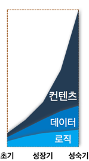

.. _intro:

第1章。 STONエッジサーバー（Edge Server）
**********************************

.. toctree::
   :maxdepth: 2

サービス設計の原則
===================
サービスの成功は可用性速度拡張性にかかっています。「拡張性Webアーキテクチャと分散システムの設計」を書いたKate Matsudairaもこの3つの原則を強調しました。

**可用性 (availability)**

サービスは常に可能でなければならない。障害発生時の90％のお客様は競合他社に移動します。 完全なシステムはないが障害時の復旧は迅速なければならない。

**速度 (speed)**

ビジネスでの時間は金であります。 遅い応答時間は売上高の減少になります。 応答時間が0.1秒の遅延と売上高1％が減少します。 Amazon.comの顧客47％はWebページが2秒以内に開かれることを望みます。

**拡張性 (scalability)**

顧客は万人でも一人でもサービスはスムーズなければならない。 サイズを育て維持する努力ストレージ拡張性トランザクション処理余力も拡張性であります。 管理の拡張性欠かせない。 診断問題を理解しアップデートと変更が容易でなければならない。

すべての原則は最小のコストで守る収録効率的です。 費用はお金だけではなく時間努力訓練なども含んでいます。

成功サービスは 急成長します。 より多くの顧客とより多くのコンテンツに対処する必要があります。 成長すればするほどの原則はより守るのは難しい。 どのようにすればこの原則を簡単に最小のコストで守ることができるだろうか？

サービスの成長
===============

テストやパイロットサービスは一・二台のサーバーで開始します。 サービスが少しずつ成長しています。 サーバーの数は徐々に増える。 コンテンツの更新は一台ずつ入念にする必要があります。 まだ力技で何とかできます。

サービスが成長し始めています。顧客が増え積むデータがますます大きくなります。 サーバーをいちいち管理することも難しくなります。 データを一箇所に集める高コストのストレージを導入します(NAS、SAN、DAS など)。 高コストであるが信頼することができるようだ。 コンテンツ更新が容易になった。ストレージにあげたコンテンツはサーバー側に自動的に更新されます。

サービスが成長します。 サーバー台数が増えてストレージの転送負荷が大きくなった。 より速いストレージはとても高価です。 導入をためらわれる。 投資する価値があるか。

同期（synchronization）ソリューションを検討します。 サーバーにデータ全体を準備することはできない。ストレージのコンテンツを選別する必要があります。 正確に制御するには高度な管理技術が必須だ。 少ない台数のサーバーの同期管理は簡単だ。 ただしサーバーとファイル数が増えるほど難しくなります。 ますます状況は悪化されます。 大きくなるほど遅くなり難しく不安定になります。

コンテンツが速い速度で更新されます。更新ファイルが多くなるほど同期時間が長くなります。 サービスの規模が大きくなるほど同期管理システムも同然に大きくなって複雑になります。 管理システムの障害はすぐに全体の障害を起こす。

コンテンツを迅速・円滑に配信する簡単な方法が必要になります。

.. _intro_service_scaling:

サービス拡張性と配信
=====================

階層化（layering）にサービスをモデル化すると次の図のように2層に分かれます。

.. figure:: img/intro_2layers.png
   :align: center

中心にデータを管理するストレージ（storage）の層があります。 その上にサービスロジックが実装されたアプリケーション（application）階層があります。 アプリケーション層は小規模顧客向けコンテンツ配信も処理することができます。 初期にはストレージとアプリケーション層のみでサービスを構成することができます。

サービスが成長し処理費用は変わります。初期にはロジックの開発が成長期には顧客の増加とともにデータ管理が最も多くの費用です。サービスが発展するほど最大の悩みは **コンテンツ配信** になります。急増するトラフィックをどう解決するのか？ **コンテンツ配信** はサービス増設（Scale-out）の大きな課題になります。

エッジ（edge）：トランスポート層
==========================

.. figure:: img/intro_3layers.png
   :align: center

サービスが成長すると配信の負担は指数的に増加します。ショッピングモールのコンテンツ数は多ければ数十億個に達します。 動画サービスのコンテンツはTBに達して久しい。サービスの増設には コンテンツ配信の拡張性（scalability）を考慮する必要があります。

エッジ（edge）はサービスの最も外側最前方を指す。 エッジでは顧客はサービスの応答速度を体験します。 顧客が要求しているコンテンツは「必ず」応答する必要があります。 壊れたエラーイメージ・接続不能は非常に致命的になります。 エッジでコンテンツ配信を処理するとアプリケーションとストレージの転送負担が減ります。

エッジの拡張が効率的であれば他の高コストの層を増設する必要がない。 ストレージとアプリケーションの増設は高コストの非効率的選択であります。

STONエッジサーバーは以下の方法で迅速・簡単なコンテンツ配信を実現します。

エッジサーバーの動作：キャッシュ（cache）
=========================================

.. figure:: img/intro_cache1.png
   :align: center

送信の規模は顧客の数とコンテンツのサイズに比例して大きくなります。 どのように多くの顧客がどのようなコンテンツを要求していることはエッジで最も早く知ることができます。 エッジからBottom-upの処理の流れが効率的であります。 したがってエッジサーバーは顧客の要求に応じてOn-demandで動作する **キャッシュ(cache)** 伝送方式を採用した。 管理システムもいりません。具体的な動作は以下の通りです。

.. figure:: img/intro_cache2.png
   :align: center

エッジサーバーは最初のコンテンツ転送要求を受けたとき元の階層からコンテンツを取得し顧客に送信します。 このコンテンツをエッジサーバーは自分にも保存します。 第二の要求とその後は保存されたコンテンツを顧客にすぐに送信します。 保存されたコンテンツは設定されたTTL（Time-To-Live）時間だけ有効であります。

エッジサーバーはこれらの方法でㅅ大量のコンテンツ配信を処理することができます。 アプリケーションとストレージの増設を最小限に抑えながら高速大容量伝送を処理します。 成長するサービスであれば必ずエッジを考慮する必要があります。

STONエッジサーバーは無制約・無依存環境を志向するソフトウェアです。 どんなハードウェアにインストールしても最大のパフォーマンスを発揮できるように設計されています。

**CPU:** Many-Coreに最適化された。Throughputはコア数に比例します。

**Memory:** Memoryが多ければ多いほど高速に処理します。 Disk I / Oを削減します。

**Disk:** I/O を均等に分散します。より多くのデータをcachingします。

**NIC:** 4Gbps NIC Bondingまたは10Gbps NICのBandwidthを保証します。

STONエッジサーバーは **強力な実時間モニタリング/ログ** をサポートします。 秒単位のリアルタイム統計にすぐサービスの状態がどうかを確認することができます。 JSON、XML、SNMP などのいくつかの汎用フォーマットでリアルタイムの数値を提供します。

STONは管理者のための **簡単な設定** を提供します。 STONの設計理念は管理者のためのエッジサーバーであります。 Web Managementページを使用して直感的な設定方法を提供します。 ディテールの設定を希望する場合単2つのXML設定ファイルに簡単にすることができます。

エッジサーバーの影響
======================
エッジサーバーの効果は次の通りであります。

#. 簡単で便利なサービス加速
#. サービスのソースを外部から保護 (Origin Shielding)
#. サービスが重要な役割を実行することができるよう補助

エッジサーバーの影響は次の適用事例を中心にも確認することができます。

Game
----------------------------

伝統的にゲームサービスは信じられないほど多くの帯域幅を必要とします。 「大作」 のゲームから簡単なカジュアルゲームまで種類も非常に多様であります。 特にスマートフォンゲームの爆発的な成長はサービス形態をより多様にした。

.. figure:: img/icons_game.png
   :align: center

- **高い帯域幅**

  単一のサーバーで高帯域幅を得る従来の方法は1Gbps NICをボンディング（Bonding）するものであります。 これにより4Gbpsの帯域幅まで得ることができます。 最近10Gbps NICも市場に多く普及している傾向にあります。

  ``STON`` 4Gbps NIC Bondingと10Gbps NICも最大帯域幅を保証します。

- **ユーザーの帯域幅を保証**

  すべてのユーザーはゲームをすぐにダウンロード・プレイしたい。 光LANユーザーは100Mbpsの速度が得られない場合クレームの電話をかけるだろう。 サーバーは物理的に各ユーザーへ最大速度を提供する必要があります。

  ``STON`` すべてのユーザーに最大速度で転送することを保証します。

- **大容量ファイルの処理**

  インストールファイルがxGB程度のゲームはいまはのゲームでは普通のサイズだ。 数十GBは必要があり「大作」という単語を取り付けることができる世界であります。 ファイルが大きすぎる場合サーバーのメモリにファイルのすべてがCachingできない。 最悪の状況はファイルのサイズが大きすぎてユーザーごとにダウンロードされる位置がまちまちである状況であります。

  ``STON`` Cachingファイルサイズの制限がない。 MemoryとDiskへの適切なSwap処理でいつでも高性能を保証します。

- **Range要求の処理**

  ファイルの転送が大型化されている傾向に基づいてGrid Delivery手法のP2Pソリューションも多く使用されています。 このようなソリューションはファイルを細かく分けた送受信が発生するためサーバーに非常に多いHTTP Rangeリクエストを届く。 10GBのファイルを万人の顧客が異なるRangeに要求する状況もありえます。 どの部分を要求してもサービスはすぐに応答する必要があります。 しかしOriginのサーバーでは必ず元のファイルのサイズ分だけのデータが送信されるべきであります。

  ``STON`` Range要求に最適化されたファイルシステムが搭載された。 またマルチダウンロードに迅速な応答性を確保します。 オリジンサーバーから1Bytesも不要ダウンロードはしません。

ショッピングモール
----------------------------

ショッピングモールはサイトのアクセスが顧客の売上と直結します。 今伝統的なPC環境だけでなくモバイルショッピングが当たり前になった。 ショッピング環境が多様化だけではなく無限に増えるファイルを管理する必要があります。

.. figure:: img/icons_shopping.png
   :align: center

- **無限大の小さなファイル**
   「億単位以上」「無数の」「いつも増加する」ファイルを保存するためには高価なStorageが必要であります。 しかし経済性が重要なEdgeサーバーではそのことができない。 サイズが1KBのファイルが10億個存在するサービスもあることができます。 結論としてすべてのファイルをCachingできない。 オリジンサーバーの負荷を最小限に抑えるながらもアクセス頻度が高いファイルを常に維持する方法が必要であります。

  ``STON`` メモリとDiskリソースの最大容量だけCachingします。 すべてのファイルのアクセス頻度はリアルタイムで管理されLRU（Least Recently Used）によって古いファイルの順に削除されます。

- **多くのユーザー**

  ショッピングモールは多くのユーザーを同時に処理することができなければならない。 急なイベントによってユーザー接続が爆発的に増加（= Burst）もあります。 Burst時サーバーは自分自身を保護する必要がありBurst後も安定性を維持する必要があります。

  ``STON`` CPU拡張性（Scalability資源の増設によりソリューションの性能が高まること）を保証します。 弾力性のあるHTTP Keep-Alive処理とソケットの管理を使用してBurst時にも安定性を確保します。

- **反応性**

  快適なショッピング環境とページがすぐにロードされていることを意味します。 ユーザーは待たない。 3秒以内にロードされない場合他のサイトに残します。 一般的にメインページには100個前後のファイルで構成され物理的な環境を考慮しても通常1秒台にページが完全にロードされるべきであります。

  ``STON`` リアルタイムファイルのインデックスを使用したすぐに応答を保証します。 ソフトファイル交換を介して元の依存関係がなく反応性を最大化することができます。 すべてのHTTP応答（First byte応答トランザクションの完了）のログと統計数値を提供してパフォーマンスの低下かどうかをリアルタイムに検出することができます。

- **ページTTL**

  大半のユーザーの移動経路はメインページ - >大カテゴリページ - >小型カテゴリー - >詳細ページ順であります。 ページごとに露出頻度が異なるだけでなく更新たりも異なるべきであります。 スマートなページCaching及び更新の方法が必要であります。

  ``STON`` URLごとに個別のTTLを付与することができます。 またPurge、Expire、ExpireAfter、 HardPurge など状況に応じて様々な方式の更新方法を提供します。

メディア
----------------------------

メディア専用のプロトコルは徐々に居場所を失っています。 HTTP、MP4のシンプルだが強力な組み合わせは徐々に勢力を広げています。 モバイルの可変の接続状態を考慮すればHTTPベースのStreaming方式が送信標準になるだろう。

- **メディア認識**

  これ以上ファイルをChunkとして認識してはならない。 メディアファイルを正確に認識することができこそ帯域幅の節約と一緒に様々な付加機能を連動することができます。 サーバーがファイルの解釈のためにファイルのすべての部分を必要とする場合ユーザーは映像の再生を放棄するものであります。
  
  ``STON`` MP4、MP3、M4A、FLV 形式をサポートします。 ダウンロードと同時にHTTP Pseudo Streamingのために必要な領域を優先的にCachingします。

- **メディアヘッダーの再配置**

  ヘッダが背後にあるファイルの場合HTTP Pseudo Streamingが不可能であります。 そのためには専用のプレイヤーが必要ですがこれユーザーに迷惑を+10します。

  ``STON`` MP4ファイルのエンコード後のヘッダーが後に付く場合ヘッダーを今後移す作業をさらに行う必要があります。 STONは自然にヘッダを前に移して整備します。

- **帯域幅の調整**

  ほとんどの映像を最後まで見るユーザーは珍しい。 したがって再生に無理がないように必要な分だけの帯域幅を使用することが効率的な伝送方法であります。 同じ映像であっても360p480p720p1080pのようにBitrateを多様にサービスします。

  ``STON`` Bandwidth-Throttlingを通じてメディアファイルの転送帯域幅を最適化することができます。

- **区間抽出**

  プレビュー/ハイライト/共有するなどファイル全体ではなく特定の区間だけをサービスする場合も多い。 サービスを提供するすべてのファイルに対して区間を抽出することは時間とストレージ容量を過度に無駄にします。 さらにユーザーごとに抽出区間が異なる場合もあります。 またSkip機能を区間再生に実装するプレイヤーも存在します。

  ``STON`` Trimming機能により区間を抽出して完全な形のメディアファイルにサービスします。

ニュース/コミュニティ
----------------------------

非常に高い忠誠心のユーザー層を確保したサイトは興味深い点が多い。 同じ興味を持つユーザーが集まるので交流が盛んでページに留まる時間も非常に長い。 サービスパターンがバラバラだとサービスするかなり難しい。

.. figure:: img/icons_news.png
   :align: center

- **304 Not Modified**

  サイトの忠誠心が非常に高いため既に多くのファイルをユーザーのローカルに保存しています。 ので実際に転送されるファイルよりも「変更の確認」の割合が圧倒的であります。

  ``STON`` 頻繁にアクセスされるファイルは常にメモリに常駐するように保証します。 「変更の確認」 の作業は待つことなくすぐに処理されます。

- **Bypass**

  ユーザーに特化したページや新しい記事リップルなどのページは常にCachingできない領域を含んでいます。 しかしDomainを別々に分けずに単一のドメインをReverse-Proxyに委任する場合が多い。

  ``STON`` 多様な条件に基づいてバイパス対象を精巧に分類します。またOrigin AffinityPrivate機能を利用してログインセッションを維持することができます。

- **不安定なオリジンサーバー**

  中小企業や個人が運営するサイトは高価な機器やインフラで運営するのは難しい。 オリジンサーバーの障害の頻度が比較的高くこれを克服するための経済性は非常に悪い。

  ``STON`` 元サーバーの過負荷や障害を判断して自動的に排除/復旧が行われる。 オリジンサーバーの障害時にTTLを自動的に延長させてオリジンサーバー依存を最小限に抑えています。

- **イメージ加工**

  同じイメージをユーザーの環境に応じて多様に示す必要があります。 検索結果ではThumbnailイメージをニュースサイトでは 「XXニュース」 のような文字をウォーターマークとして表示する必要があります。 同じイメージを表示される形態に応じて毎回処理することはストレージ容量と時間労働力の浪費だ。

  ``STON`` :ref:`media-dims` 機能を使用するとオリジンサーバーに単一のイメージだけで所望の形状をURL呼び出しだけで生成することができます。。

ファイルベースのサーバー
----------------------------

EdgeはReverse-Proxy構造に基づいています。Reverse-Proxyの重要な概念はリモートサーバー上のファイルをローカルに複製/更新/管理するものです。 すでに検証されたSTONをサービスサーバと連動することができればStorage一元化と同期の問題を除去することができます。 だけでなく開発時間の短縮とサービスの信頼性の向上の二匹のウサギをすべてキャッチすることができます。

.. figure:: img/icons_file.png
   :align: center

- **File I/O サポート**

  専用プロトコルが必要な場合該当プロトコルモジュールに依存するサーバーになります。なんとか連動しても性能が低下すると無用の長物になります。プロトコルモジュールとサーバーとの間の中間段階は最小限にする必要があります。

  ``STON`` 標準File I / OでSTONが連動されます。 専用サーバーとSTONの間にはLinux Kernel（VFS）のみが存在し高性能を保証します。

- **Web Server 連動**

  標準Webサーバ(Apache、Lighttpd、NginX)に特化した拡張モジュールがインストールされている場合標準のReverse-Proxyを導入が難しくなる可能性があります。DB / WASと連動されているファイルサービスや課金/決済サービスのような場合は簡単のサービスを拡張するのは難しい。

  ``STON`` ApacheのDocumentRootをSTONに指定するとApacheはSTONを物理ディスクとして認識します。 それ以外の設定はいらない。

- **Wowza 連動**

  メディアサービスではWowzaが事実上の標準であります。 しかしWowzaのHTTP Caching機能の使用は面倒で弱いです。また徐々にHTTP以外の「専用」のプロトコルは減少傾向にあります。

  ``STON`` ローカルディスクにMountできるだけでなくMP4ヘッダの変換Trimmingなどすべての機能を利用することができます。

- **リソースの制約**

  Back-endに存在するファイルをFront-Endのユーザーに配信するサーバーであれば常にファイルの同期が問題になります。 ゲームサーバSNSサーバなどの専用サーバーの開発問題は常に存在します。 このようなサーバーの場合中断することなく長期間運用されるべきなのでメモリディスクの使用が厳しく制限される必要があります。

  ``STON`` 最大使用メモリディスク使用量を制限することができます。 またディスクとしてMountしても他のすべての機能は同じように動作し複合的なサービスを最小限のソリューションで構成することができます。

STONはこれらの特性を積極的に活用する以下のようなのサービスと一緒に成長しています。

.. figure:: img/intro_reference.png
   :align: center
