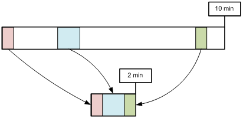

.. _media-video:

第18章 動画
******************

.. note::

   - `[動画講座]みよう！ STON Edge Server - Chapter 5. 動画配信 <https://youtu.be/YjOEVamhah4?list=PLqvIfHb2IlKeZ-Eym_UPsp6hbpeF-a2gE>`_

この章では、ビデオ/オーディオをスマートにサービスする方法について説明する。 クライアント側は、シームレスなスムーズな再生が一貫性のある目的に対し、サーバ側では、非常に複雑である。 画質の上昇は、より大きな動画を作成し、より多くの帯域幅とストレージ容量を必要とする。 STONは、様々なOn-the-fly手法を用いて、既存Back-Endの修正なし柔軟な転送機能を提供する。 

.. toctree::
   :maxdepth: 2

.. _media-hls:

MP4 HLS
====================================

MP4ファイルをHLS（HTTP Live Streaming）にサービスする。 ソースサーバーは、もはやHLSサービスのためにファイルを分割保存する必要がない。 MP4ファイルのヘッダの位置に関係なく、ダウンロードと同時にリアルタイムで.m3u8 / .tsファイルの変換後のサービスである。

..  note::

    MP4HLSはElementary Stream（VideoまたはAudio）を変換するトランスコーディング（Transcoding）ではない。 したがって、HLSに適した形式でエンコードされたMP4ファイルに限って円滑な端末の再生が可能である。 エンコーディングが適合しない場合は、画面が割れたり音が再生されないことがあります。 現在（2014.2.20）Appleの言っているVideo / Audioエンコード規格は、次のとおりである。

    What are the specifics of the video and audio formats supported?
    Although the protocol specification does not limit the video and audio formats, the current Apple implementation supports the following formats:

    [Video]
    H.264 Baseline Level 3.0, Baseline Level 3.1, Main Level 3.1, and High Profile Level 4.1.

    [Audio]
    HE-AAC or AAC-LC up to 48 kHz, stereo audio
    MP3 (MPEG-1 Audio Layer 3) 8 kHz to 48 kHz, stereo audio
    AC-3 (for Apple TV, in pass-through mode only)

    Note: iPad, iPhone 3G, and iPod touch (2nd generation and later) support H.264 Baseline 3.1. If your app runs on older versions of iPhone or iPod touch, however, you should use H.264 Baseline 3.0 for compatibility. If your content is intended solely for iPad, Apple TV, iPhone 4 and later, and Mac OS X computers, you should use Main Level 3.1.

従来方式の場合、Pseudo-StreamingとHLSのために、以下のように、元のファイルがそれぞれ存在しなければならない。 このような場合、STONも、元のファイルをそのまま複製して、顧客にサービスする。 しかし、再生時間が長いほど、派生ファイルは多くなり、管理の難しさは増加する。

.. figure:: img/conf_media_mp4hls1.png
   :align: center

   手間が多くHLS

``<MP4HLS>`` は、元のファイルからHLSサービスに必要なファイルを動的に生成する。

.. figure:: img/conf_media_mp4hls2.png
   :align: center

   スマートHLS

すべての.m3u8 / .tsファイルは、元のファイルから派生し、別のストレージスペースを消費しない。 サービスすぐにメモリに一時的に生成されサービスされない場合自動的に消える。 ::

   # server.xml - <Server><VHostDefault><Media>
   # vhosts.xml - <Vhosts><Vhost><Media>

   <MP4HLS Status="Inactive" Keyword="mp4hls">
      <Index Ver="3" Alternates="off">index.m3u8</Index>
      <Sequence>0</Sequence>
      <Duration>10</Duration>
      <AlternatesName>playlist.m3u8</AlternatesName>
   </MP4HLS>

-  ``<MP4HLS>``

   - ``Status (デフォルト: Inactive)`` の値が ``Active`` の場合にのみ有効になる。

   - ``Keyword (デフォルト: mp4hls)`` HLSサービスキーワード

-  ``<Index> (デフォルト: index.m3u8)`` HLSインデックス（.m3u8）ファイル名 

   - ``Ver (デフォルト 3)`` インデックスファイルのバージョン。 3である場合、 ``#EXT-X-VERSION:3`` ヘッダが明示されて ``#EXTINF`` の時刻の値が小数点3桁目まで表示される。
     1の場合、 ``#EXT-X-VERSION`` ヘッダがなく、 ``#EXTINF`` の時間値が整数（丸め）に表示される。

   - ``Alternates (デフォルト: OFF)`` Stream Alternates使用するかどうか。

     .. figure:: img/hls_alternates_off.png
        :align: center

        OFF. ``<Index>`` でTSリストをサービスする。

     .. figure:: img/hls_alternates_on.png
        :align: center

        ON. ``<AlternatesName>`` でTSリストをサービスする。

-  ``<Sequence> (デフォルト: 0)`` .tsファイルの開始番号。 このことに基づいて順次増加する。

-  ``<Duration> (デフォルト: 10초)`` のMP4 HLSに分割する基準時間（秒）。 分割の基準は、Video / AudioのKeyFrameある。 KeyFrameはギザギザすることができますので、正確に分割されない。 もし10秒分割しようとしてKeyFrameが9秒と12秒の場合は近い値（9秒）を選択する。

-  ``<AlternatesName> (デフォルト: playlist.m3u8)`` Stream Alternates ファイル名。 ::

      http://www.example.com/video.mp4/mp4hls/playlist.m3u8

サービスアドレスは次のとおりである場合は、そのアドレスにPseudo-Streamingを行うことができる。 ::

    http://www.example.com/video.mp4

仮想ホストは ``<MP4HLS>`` に定義された ``Keyword`` 文字列を認識することにより、HLSサービスを進行する。
次のURLが呼び出されると、/video.mp4からindex.m3u8ファイルを生成する。 ::

   http://www.example.com/video.mp4/mp4hls/index.m3u8

``Alternates`` 属性がONであれば、 ``<Index>`` ファイルは、 ``<AlternatesName>`` ファイルをサービスする。 ::

   #EXTM3U
   #EXT-X-VERSION:3
   #EXT-X-STREAM-INF:PROGRAM-ID=1,BANDWIDTH=200000,RESOLUTION=720x480
   /video.mp4/mp4hls/playlist.m3u8

``#EXT-X-STREAM-INF`` の Bandwidth와 Resolutionは映像を分析して、動的に提供する。

.. note::

   Stream Alternatesを提供しますが、現在のバージョンではindex.m3u8は常に一つのサブインデックスファイル（playlist.m3u8）だけを提供する。 キャッシュの立場では、video_1080.mp4とvideo_720.mp4が（エンコードオプションが、他の）のような映像なのか知ることができないからである。

最終的に生成された.tsリスト（バージョン3）は、次のとおりである。 ::

   #EXTM3U
   #EXT-X-TARGETDURATION:10
   #EXT-X-VERSION:3
   #EXT-X-MEDIA-SEQUENCE:0
   #EXTINF:11.637,
   /video.mp4/mp4hls/0.ts
   #EXTINF:10.092,
   /video.mp4/mp4hls/1.ts
   #EXTINF:10.112,
   /video.mp4/mp4hls/2.ts

   ... (中略)...

   #EXTINF:10.847,
   /video.mp4/mp4hls/161.ts
   #EXTINF:9.078,
   /video.mp4/mp4hls/162.ts
   #EXT-X-ENDLIST

分割には、3つのポリシーがあります。

-  **KeyFrame \間隔よりも** ``<Duration>`` **の設定が大きい場合**
   KeyFrameが3秒、 ``<Duration>`` が20秒であれば、20秒を超えないKeyFrameの倍数である18秒に分割される。

-  **KeyFrame間隔と** ``<Duration>`` **が似ている場合**
   KeyFrameが9秒、 ``<Duration>`` が10秒であれば、10秒を超えないKeyFrameの倍数である9秒分けられる。

-  **KeyFrame 間隔が** ``<Duration>`` **に設定よりも大きい場合우**
   KeyFrame単位に分割される。

次のクライアント要求に対してSTONがどのように動作するのかを理解しましょう。  ::

   GET /video.mp4/mp4hls/99.ts HTTP/1.1
   Range: bytes=0-512000
   Host: www.winesoft.co.kr

1.	``STON`` 最初のロード（何もキャッシュされていない。）
#.	``Client`` HTTP Range要求（100番目のファイルの最初の500KBリクエスト）
#.	``STON`` /video.mp4ファイルのキャッシュオブジェクトの作成
#.	``STON`` /video.mp4ファイルの分析のために必要な部分だけを元のサーバーからダウンロード
#.	``STON`` 100番目（99.ts）ファイルサービスのために必要な部分だけを元のサーバーからダウンロード
#.	``STON`` 100番目（99.ts）ファイルを作成した後Rangeサービス
#.	``STON`` サービスが完了すると、99.tsファイル破壊

.. note::

   ``MP4Trimming`` 機能が ``ON`` ならTrimmingたのMP4 HLSに変換できる。 （HLS画像をTrimmingすることができない。HLSのMP4ではなく、MPEG2TSであることに注意しよう。）映像をTrimmingした後、HLSに変換するため、次のように表現するのが自然である。 ::

      /video.mp4?start=0&end=60/mp4hls/index.m3u8

   動作には問題ありませんがQueryStringを一番後ろに付けるHTTP仕様に反する。 これを補完するために、次のような表現も動作は同じである。 ::

      /video.mp4/mp4hls/index.m3u8?start=0&end=60
      /video.mp4?start=0/mp4hls/index.m3u8?end=60

.. _media-mp3-hls:

MP3 HLS
====================================

MP3ファイルをHLS（HTTP Live Streaming）にサービスする。 ::

   # server.xml - <Server><VHostDefault><Media>
   # vhosts.xml - <Vhosts><Vhost><Media>

   <MP3HLS Status="Inactive" Keyword="mp3hls" SegmentType="TS">
      <Index Ver="3" Alternates="off">index.m3u8</Index>
      <Sequence>0</Sequence>
      <Duration>10</Duration>
      <AlternatesName>playlist.m3u8</AlternatesName>
   </MP3HLS>

すべての設定と動作が `MP4 HLS`_ と同じでさらにSegement形式を選択することができる。 

-  ``<MP3HLS>``

   - ``SegmentType (デフォルト: TS)`` ソースのMP3 MPEG2-TS( ``TS`` ) または ``MP3`` に分割する。

.. note::

   `MP4 HLS`_ と `MP3 HLS`_ が同じ ``Keyword`` に設定されている場合、 `MP3 HLS`_ は動作しない。

MP4/M4A ヘッダの位置を変更
====================================

通常MP4形式の場合エンコード処理中にヘッダを完成することができないため、完了後にファイルの末尾に付ける。 ヘッダを今後移動するには、別の処理が必要である。 ヘッダが続いている場合、これをサポートしていないプレーヤーでPseudo-Streamingが不可能である。 ヘッダの位置の変更により、Pseudo-Streamingを簡単にサポートすることができる。

ヘッダの位置の変更は、送信段階でのみ発生するだけでテキストの形を変更しない。 別のストレージスペースを使用することもない。 ::

   # server.xml - <Server><VHostDefault><Media>
   # vhosts.xml - <Vhosts><Vhost><Media>

   <UpfrontMP4Header>OFF</UpfrontMP4Header>
   <UpfrontM4AHeader>OFF</UpfrontM4AHeader>

-  ``<UpfrontMP4Header>``

   - ``OFF (デフォルト)`` 何もしない。

   - ``ON`` 拡張子が.mp4でヘッダが続いている場合、ヘッダーを今後移し送信する。

-  ``<UpfrontM4AHeader>``

   - ``OFF (デフォルト)`` 何もしない。

   - ``ON`` 拡張子が.m4aでヘッダが続いている場合、ヘッダーを今後移し送信する。

最初に要求されているコンテンツのヘッダを前に移動する必要が場合、ヘッダを移すために必要な部分を優先的にダウンロードされる。 非常にスマートなだけでなく高速に動作する。 カーテンの後ろの複雑なプロセスとは関係なく、クライアントはもともとヘッダが前にある完全なファイルをサービス受ける。

.. note::

   分析することができない場合、または壊れたファイルであれば、元の形のままサービスされる。

.. _media-trimming:

Trimming
====================================

時間値に基づいて必要な区間を抽出する。 Trimmingは送信段階でのみ発生するだけでテキストの形を変更しない。 別のストレージスペースを使用していない。 ::

   # server.xml - <Server><VHostDefault><Media>
   # vhosts.xml - <Vhosts><Vhost><Media>

   <MP4Trimming StartParam="start" EndParam="end" AllTracks="off">OFF</MP4Trimming>
   <M4ATrimming StartParam="start" EndParam="end" AllTracks="off">OFF</M4ATrimming>
   <MP3Trimming StartParam="start" EndParam="end">OFF</MP3Trimming>

-  ``<MP4Trimming>`` ``<MP3Trimming>`` ``<M4ATrimming>``

   - ``OFF (デフォルト)`` 何もしない。

   - ``ON`` 拡張子(.mp4, .mp3, .m4a)が一致すると、必要な区間だけサービスするようにTrimmingする。 Trimming区間は ``StartParam`` 属性と ``EndParam`` に設定する。

   - ``AllTracks`` 属性

     - ``OFF (デフォルト)`` Audio / VideoトラックのみTrimmingする。 （Mod-H264方式）

     - ``ON`` すべてのトラックのTrimmingする。 使用前に必ずプレーヤーの互換性を確認しなければならない。

パラメータは、クライアントQueryStringを介して入力される。 たとえば、10分の動画（/video.mp4）を特定区間だけTrimmingしたい場合はQueryStringに任意の時点（単位：秒）を指定する。 ::

   http://vod.wineosoft.co.kr/video.mp4                // 10分：全ムービー
   http://vod.wineosoft.co.kr/video.mp4?end=60         // 1分：最初から60秒まで
   http://vod.wineosoft.co.kr/video.mp4?start=120      // 8分：2分（120秒）から最後まで
   http://vod.wineosoft.co.kr/video.mp4?start=3&end=13 // 10秒：3秒から13秒まで

``StartParam`` 値が ``EndParam`` 値よりも大きい場合、区間が指定されていないものと判断する。 この機能は、HTTP Pseudo-Streamingに実装されたビデオプレーヤーのSkip機能のために開発された。 したがって、Range要求を処理するようにファイルをOffsetに基づいて切らずに正常に再生されるように、キーフレームと時間を認知して区間を抽出する。

クライアントに配信されるファイルは、次の図のようにMP4ヘッダが再生成された完全な形のMP4ファイルである。

   完全な形のファイルが提供される。

抽出された区間は、別のファイルとして認識されるため、200 OKで応答される。 したがって、次のようにRangeヘッダが記載されている場合、抽出されたファイルからRangeを計算して **206 Particial Content** で応答する。

.. figure:: img/conf_media_mp4trimming_range.png
   :align: center

   一般的なRangeリクエストのように処理される。

区間抽出パラメータがQueryString表現を使用するため、ややもすると :ref:`caching-policy-applyquerystring` と混乱することができる。
``<ApplyQueryString>`` の設定が ``ON`` の場合、クライアントが要求されたURLのQueryStringがすべて認識され ``StartParam`` と ``EndParam`` は除去される。 ::

   GET /video.mp4?start=30&end=100
   GET /video.mp4?tag=3277&start=30&end=100&date=20130726

例えば上記のように ``StartParam`` が **start** で ``EndParam`` が **end** で入力された場合、この値は、区間を抽出するのに使われるだけでCaching-Keyを生成したり、元のサーバーに要求を送信する場合は削除される。 それぞれ次のように認識される。 ::

   GET /video.mp4
   GET /video.mp4?tag=3277&date=20130726

また、QueryStringパラメータは、拡張モジュールやCDNソリューションによって異なることができる。

.. figure:: img/conf_media_mp4trimming_range.png
   :align: center

   JW Playerで提供しているModule / CDN星参考資料

以外のnginxの `ngx_http_mp4_module <http://nginx.org/en/docs/http/ngx_http_mp4_module.html>`_ と、
lighttpdの `Mod-H264-Streaming-Testing-Version2 <http://h264.code-shop.com/trac/wiki/Mod-H264-Streaming-Testing-Version2>`_ もすべて **start** をQueryStringに使用している。

.. _media-multi-trimming:

Multi-Trimming
====================================

時間値に基づいて、複数の指定された区間を一つの映像として抽出する。

   /video.mp4?trimming=0-30,210-270,525-555

区間の指定方法が違うだけで動作は `Trimming`_ と同じである。 ::

   # server.xml - <Server><VHostDefault><Media>
   # vhosts.xml - <Vhosts><Vhost><Media>

   <MP4Trimming MultiParam="trimming" MaxRatio="50">OFF</MP4Trimming>
   <M4ATrimming MultiParam="trimming">OFF</M4ATrimming>

-  ``<MP4Trimming>`` ``<M4ATrimming>``

   - ``MultiParam (デフォルト: "trimming")``
     に設定され名前をQueryString Keyとして使用して抽出区間を指定する。 一つの区間は "開始時刻 - 終了時刻" と表記し、各区間はコンマ（、）で接続する。

   - ``MaxRatio (デフォルト: 50%)``
     Multi-Trimmingされた映像は、オリジナルよりも ``MaxRatio (最大 100%)`` の割合だけまで大きくなることができる。
     ``MaxRatio`` を移る区間は無視される。

例えば、次のように起動すると、3分の映像が生成される。 ::

   http://example.com/video.mp4?trimming=10-70,560-620,1245-1305

同じ映像を繰り返したり、前の背部変わった映像を作成することもできる。 ::

   http://example.com/video.mp4?trimming=17-20,17-20,17-20,17-20
   http://example.com/video.mp4?trimming=1000-1200,500-623,1900-2000
   http://example.com/video.mp4?trimming=600-,400-600

区間値を指定しない場合先頭または最後に意味する。

.. note::

   `Multi-Trimming`_ は `Trimming`_ より優先する。 QueryStringに `Multi-Trimming`_ キーが明示されている場合は `Trimming`_ キーは無視される。

