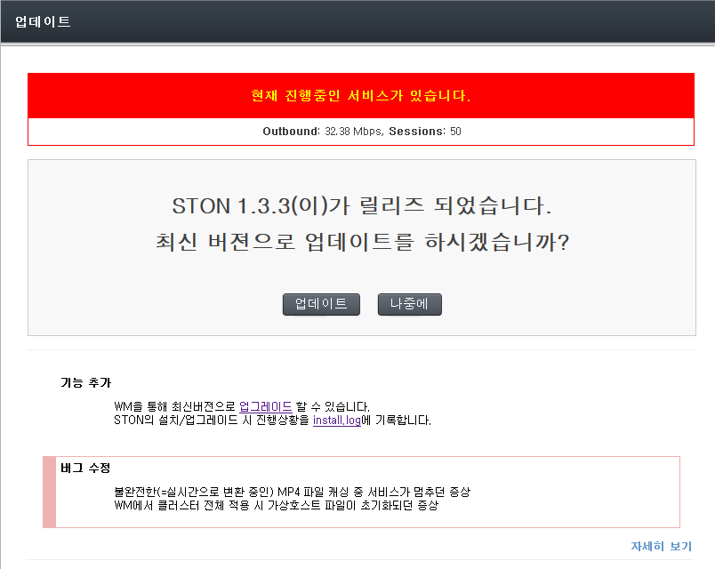
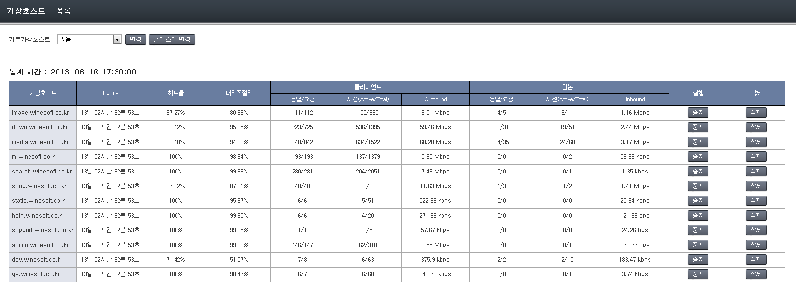
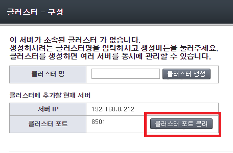
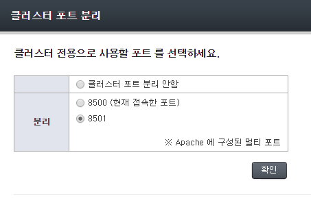

.. _wm:

第13章 WM（Web Management）
******************

この章ではWeb Management（以下WM）を紹介する。 WMはAPIをベースに動作するWeb管理ツールである。 WMを介して直感的にサービスを構成することができるだけでなく、クラスタを構成して、多数のSTONを統合管理することができる。

STONをインストールすると/usr/local/ston/wmパスにWMが設置されます。 WMはApache 2.2.24 + PHP 5.3.24に実装された。 Apacheを使用するため/usr/local/ston/wm/conf/httpd.confファイルを編集して必要な構成（例えばHTTPS）に変更が可能です。 WMとSTONは密接な関連を持たない。 次の図のようにWMはSTONの設定ファイルとAPIのみでSTONの動作を構成します。

   WMはSTONの設定ファイルとAPIを使用します。

私たちは、同様の方法でWMを凌駕する優れた管理手法が存在すると考えている。

.. toctree::
   :maxdepth: 2

接続
====================================

WMは8500番ポートを使用します。 インストールされたSTONのIPアドレスが192.168.0.100の場合WMアクセスアドレスは http://192.168.0.100:8500になる。 httpd.confファイルを変更するとカスタマイズが可能です。

.. figure:: img/wm_login.jpg
   :align: center

   WM接続の初期画面

アカウント
====================================

デフォルトのアカウントは [ユーザ名: **admin** 、 パスワード: **ston** ] です。 ログインに成功するとSTONの全体的な状態を確認できるダッシュボードページが表示されます。

.. figure:: img/wm_main.jpg
   :align: center

   WMのダッシュボード

.. _wm-update:

最新バージョンの更新
====================================

最新バージョンがリリースされると次のように "新しいアップデートがあります" というメッセージが表示されます。

.. figure:: img/wm_update_info.png
   :align: center

   新しい更新があります。

メッセージをクリックすると最新のバージョンに更新することができるページが表示されます。 現在の動作中のサービスがある場合statusが表示されます。

   WMの更新と危険です。

アップデートが完了するとすべてのサービスが自動的に再起動されます。

メニュー構成
====================================

メニューはDrop Downメニューで構成されています。

.. figure:: img/wm_menu.jpg
   :align: center

   WMメニュー

1.  **グローバル設定**

    グローバル設定（server.xml）の仮想ホストの基本設定以外のすべての機能を設定します。

#.  **仮想ホストの管理**

    仮想ホストの追加/停止/削除ができサービス中のすべての仮想ホストの状態を一目で見ることができます。

#.  **クラスター**

    クラスターを構成/管理/削除することができ、同じクラスター内のすべてのサービスをサーバ別・サービス別に見ることができます。

#.  **コンテンツ制御**

    Purgeのようにサービスされているコンテンツに対して制御することができます。

#.  **サーバーの状態**

    システムstatusのようなグローバル・リソースをモニタリングします。 すべてのGraphはグローバルリソースのGraphを使用します。

#.  **サービスの状態**

    仮想ホストのサービスの状態をモニタリングします。 すべてのGraphは仮想ホストGraphを使用します。

グローバル設定
====================================

グローバル設定（server.xml）の仮想ホストの基本設定以外のすべての機能を設定します。

.. figure:: img/wm_conf_global1.png
   :align: center

   WMグローバル設定-一般

仮想ホストの管理
====================================

サービスを提供するすべての仮想ホストについて詳細に設定し新規の仮想ホストを追加します。 すべての仮想ホストは別に明示的に設定を変更しない限りデフォルトの仮想ホスト（VHostDefault）の設定を使用します。 これはオブジェクト指向の継承（Inheritance）のような概念です。 サービスの仮想ホストはほとんどの項目を財政の（Overriding）することができます。

新規
---------------------

新たにサービスする仮想ホストを作成します。 クラスターが設定されている場合すべてのサーバーに仮想ホストを同時に生成することができます。 すべての仮想ホストはデフォルトの仮想ホスト（VHostDefault）を継承されるため仮想ホスト名と元サーバーのアドレスを設定するだけすぐにサービス投入が可能です。 8つのサブ設定があり **Expand** ボタンを押して詳細設定で拡張することができます。

.. figure:: img/wm_vhost_new1.png
   :align: center

   WM仮想ホストの管理-新規

リスト
---------------------

サービス中のすべての仮想ホストの状態をモニタリングすることができます。 仮想ホストごとに開始/停止が可能です。 クラスターが設定されている場合はすべてのサーバーの仮想ホストを同時に制御することができます。 またデフォルトの仮想ホストを選択することができます。

   WM仮想ホストの管理-リスト

詳細設定
---------------------

デフォルトの仮想ホスト（VHostDefault）と個々の仮想ホストに設定します。 左上のコンボボックスを選択して仮想ホストを選択することができます。
**"Default仮想ホスト"** はすべての仮想ホストが継承するデフォルト設定です。 したがって特別な設定がない場合 "Default 仮想ホスト" を変更すると変更された設定が反映されます。

   WMバーチャルホストの設定-トップメニュー

上の図のように多くのサブメニューが提供され現在選択されてサブメニューが赤い色で表示されます。 各メニューをクリック時下図のように詳細設定ページが提供されます。 すべての設定は "適用" または "Cluster全体に適用" ボタンを押したら反映されます。

   WMバーチャルホストの設定-オリジンサーバー

ここで設定するほぼすべての項目は上書きする設定になる明確な理解が必要です。 たとえば既定の仮想ホストのTTL値が60に設定された場合すべての仮想ホストはこの値を継承します。 しかし明示的にこの値を上書きする場合は該当仮想ホストに限って上書きされた値を使用します。

.. figure:: img/wm_vhost_conf_sub_ttl.png
   :align: center

次のように3つの場合が存在することができます。

-  **他の値で財政の**

   Aの場合のようにデフォルト値は60ですが180で上書きする場合はAユーザーは180でサービスされます。 デフォルトの仮想ホストの設定を変更しても影響を受けない。

-  **同じ値で財政の**

   Bの場合のようにデフォルト値と同じ値に設定しても上書きと判断してBのユーザーは60でサービスされます。 今後デフォルトの仮想ホストのTTL値が30に変更されても再定義がされているのでBユーザーの設定（60）は影響を受けない。

-  **上書きしない**

   Cの場合のように省略された場合デフォルトの仮想ホストの設定を継承してCユーザーは60でサービスされます。 今後デフォルトの仮想ホストのTTL値が30に変更されるとCユーザーも30でサービスされます。

WMは色で上書きを区分します。 デフォルトの仮想ホストの設定をそのまま使用している場合は白い背景で表示されます。 オーバーライドされた値は杏色に表示されてデフォルトと区別されます。 すべての上書きの設定の右側にはXボタンが提供されます。 このボタンをクリックして上書きを終了します。

.. _wm_cluster:

クラスター
====================================

複数のSTONを1つのクラスターに統合して一括して管理/運営することができます。 すべてのSTONは同等の関係に設定されるためクラスターに含まれているいくつかのSTONにログインしてもクラスター全体を管理することができます。

構成
---------------------

クラスターを作成したり既に存在しているクラスターに別のサーバーを追加することができます。 クラスターに追加にはWMアカウントの認証手続きが必要です。 同じアカウント（ユーザ名とパスワード）でWMが構成されている場合認証手続きは省略されます。

.. figure:: img/wm_cluseter1.png
   :align: center

   新規クラスターの作成

.. figure:: img/wm_cluseter2.png
   :align: center

   クラスターリスト

クラスターが構成され仮想ホストの管理時に "Cluster全体に適用" ボタンで一括設定が可能です。 またクラスターに所属されたサーバー間には簡単にすべての設定を複製することができます。 特定のサーバーを別のクラスターに参加させたい場合は分離後の再参加が必要です。

専用ポート分離
---------------------

初期インストール時にWMとクラスターポートが同じポートを使用します。 この方式はWMアカウントだけでクラスターリング構成が可能なメリットがありますがアクセスIPを制限する場合は問題になる場合があります。

* セキュリティ上の理由でWMにアクセスできるIPを制限したい。
* クラスターリングのためにはすべてのサーバーが別のサーバーのIPアドレスを許可する必要がある。
* （CDNのような）サーバーの数が非常に多いかサーバーのIPアドレスがダイナミックな場合はIPリストを作成ができない。

クラスターポートを分離してこの問題を解決することができます。 サーバー間の通信はWMアカウントではなくライセンスを使用して確認されます。 同じライセンスを持つサーバ間だけクラスター構成が可能となりセキュリティが高くなる。

**1. [Apacheサーバー] httpd.confマルチPort設定**

(デフォルトのインストールであれば) /usr/local/ston/wm/conf/httpd.conf ファイルを開き次のようにポートを追加します。

保存して反映するためのApacheサーバーを再起動します。

**2. [WM]クラスター構成**

通常のマルチポート設定がされた場合は次のように "クラスターポートの分離" ボタンが生成されます。

ボタンをクリックします。

**3. [WM]クラスターポートの選択**

分離可能なポートのリストが表示されます。 ポートを選択し構成します。

クラスターリングに参加するすべてのサーバーは同じポートを使用する必要があります。

サーバーの状態
---------------------

クラスターに参加中のすべてのSTONサーバーの状態とサービスの現状を確認することができます。 サーバーのリストを構成する各項目をクリックするとより詳細な情報を確認することができます。

.. figure:: img/wm_cluseter3_2.png
   :align: center

   サーバー別のステータス

仮想ホストの状態
---------------------

クラスターでサービスを提供するすべての仮想ホストのMRTGを総合して確認することができます。 タのすべての仮想ホストを同時に開始/停止することができます。 仮想ホストのリストを構成する各項目をクリックするとより詳細な情報を確認することができます。

.. figure:: img/wm_cluseter4.png
   :align: center

   仮想ホストのサービス別の状態

.. _wm_cluster_list_api:

API
---------------------
APIを介してクラスター構成サーバーのリストを照会することができます。 ::

   http://SERVER_IP:10040/monitoring/clusterlist

クラスターが構成されている場合結果は以下の通りです。 ::

   {
      "version": "2.5.5",
      "method": "clusterlist",
      "status": "OK",
      "result": 
      {
          "Name" : "test", 
          "Node" : 
          [ 
              { "Address" : "192.168.0.148:8500"},
              { "Address" : "192.168.0.175:8500"}
          ]
      }
   }

失敗（クラスターが構成されていない、またはクラスター照会が失敗）の状況では以下のように答えている。 ::

   {
      "version": "2.5.5",
      "method": "clusterlist",
      "status": "Fail",
      "result": { }
   }

コンテンツ制御
====================================

サービス中のコンテンツを閲覧/制御したりクリーンアップを実行することができます。 クラスター構成になっている場合はすべてのSTONのコンテンツを同時に閲覧したり制御することができます。

.. figure:: img/wm_ctrl2.png
   :align: center

   Caching状態の確認

.. figure:: img/wm_ctrl3.png
   :align: center

   PurgeなどのAPI呼び出し

システム情報
====================================

稼働中のサーバーのシステム情報を照会します。

.. figure:: img/wm_gstat1.png
   :align: center

サービスの状態
====================================

バーチャルホストごとにサービスの状態をモニタリングします。

.. figure:: img/wm_vstat3.png
   :align: center

   仮想ホストサービスの状態
